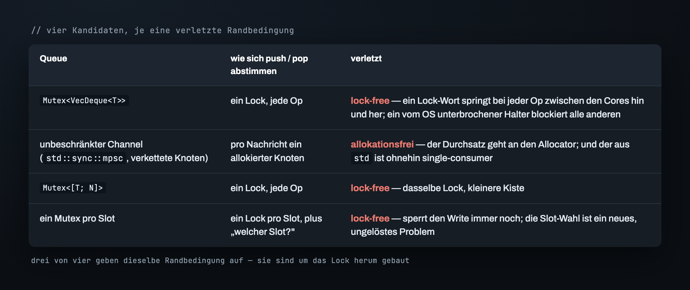
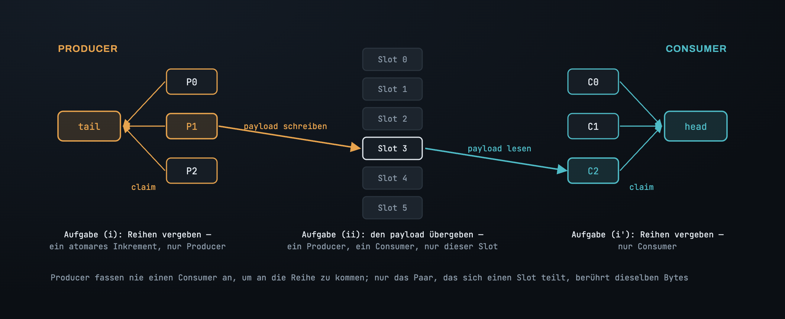
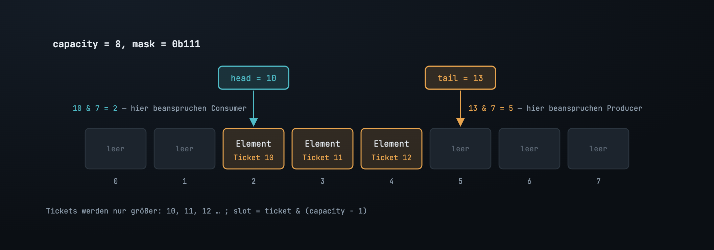
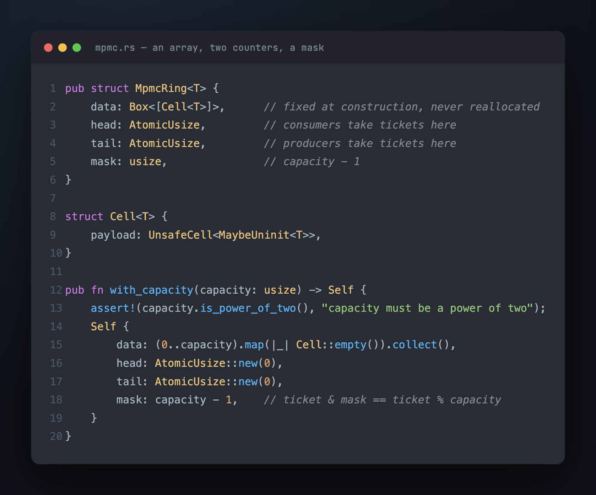

# Teil 1 — Das Problem, und warum die naheliegenden Queues nicht passen

Zwölf Feed-Handler, einer pro Core, jeder zieht Orders aus einer anderen
Exchange-Session und schiebt sie an eine einzige Stelle: den Eingang der Matching
Engine. Auf der anderen Seite poppt ein Pool von Matching-Threads aus genau diesem
Eingang. Ein paar Millionen Operationen pro Sekunde, von beiden Enden gleichzeitig, und
auf keiner der beiden Seiten kann es sich ein Thread leisten stehenzubleiben — ein
Feed-Thread, der hängt, verliert Marktdaten; ein Matcher, der hängt, weitet den Spread
bei jedem Symbol, das hinter ihm in der Queue wartet. Mitten im heißesten Pfad des
Systems sitzt eine Queue, und das Erste, wonach jeder greift, ist `Mutex<VecDeque<T>>`.

Diese Form taucht überall auf, wo schnelle Software ein schreibendes Ende hat. Ein
Write-Ahead-Log bündelt ein Dutzend Writer-Threads in einen Group Commit. Eine
Metrics-Pipeline führt Samples von jedem Worker in einem einzigen Aggregator zusammen.
Jedes Mal dasselbe Objekt: **viele Threads pushen, viele Threads poppen, auf dem Hot
Path, bei einer Rate, bei der der Overhead der Queue selbst das Budget ist.**

## Drei Randbedingungen, nicht eine

Wäre Durchsatz die einzige Anforderung, wäre das ein Benchmark und kein Designproblem.
Es ist ein Designproblem, weil die Queue drei Dinge gleichzeitig einhalten muss:

- **Beschränkt und allokationsfrei.** Ein fester Puffer, einmal dimensioniert. Keine
  `Box` pro Nachricht, kein verketteter Knoten, der beim Push alloziert und beim Pop
  freigegeben wird. Ein Allocator-Aufruf bedeutet an einem guten Tag hunderte
  Nanosekunden und an einem schlechten ein prozessweites Lock; so oder so passt er nicht
  in eine Übergabe, die in unter einer Mikrosekunde fertig sein muss.
- **Lock-free.** Kein einzelnes Speicherwort, das sich jeder Thread erst holen muss. Die
  Garantie, die wir wollen: Zu jedem Zeitpunkt macht *irgendein* Thread Fortschritt, und
  ein Thread, den das OS mitten in einer Operation unterbricht — und der dabei nichts
  hält — kann den Rest nicht einfrieren.
- **Viele-zu-viele, und nicht-blockierend.** N Producer, M Consumer, keine festen
  Rollen. Und eine `try_`-API: `try_push` auf einem vollen Ring gibt den Wert zurück;
  `try_pop` auf einem leeren Ring liefert `None`. Die Queue parkt nie einen Thread.
  Blockieren ist eine Policy, die der Aufrufer vielleicht will, und sie darf nicht fest
  ins Primitiv eingebaut sein.

Miss jeden Kandidaten unten an diesen dreien. Jeder ist korrekt, und jeder gibt genau
eine davon auf.

## Die naheliegenden Queues, je eine Randbedingung verletzt

`Mutex<VecDeque<T>>` ist das, was der meiste Code ausliefert, und es funktioniert. Aber
jeder `push` und jeder `pop` nimmt dasselbe Lock, also springt das Lock-Wort bei jeder
einzelnen Operation wie ein Pingpongball zwischen den Cores hin und her — das
MESI-Protokoll invalidiert eine cache line in jedem anderen Core, millionenfach pro
Sekunde, selbst wenn logisch gar keine Contention herrscht. Und in dem Moment, in dem
der Halter des Locks vom OS verdrängt wird, wartet jeder andere Thread darauf, dass
genau dieser eine Thread wieder eingeplant wird. Das ist das Gegenteil von lock-free.

Ein unbeschränkter Channel — `std::sync::mpsc` oder irgendeine Queue aus verketteten
Knoten — umgeht das eine Lock, indem er pro Nachricht einen Knoten alloziert. Damit
liegt der Durchsatz in der Hand des Allocators, und der aus `std` ist ohnehin schon dem
Namen nach single-consumer.

Ein `Mutex` um ein festes Array beseitigt die Allokation und behält das Lock. Ein Mutex
*pro Slot* verkleinert das Lock, ohne es loszuwerden, und bringt ein Problem mit, das
das Design vorher nicht hatte: entscheiden, welchen Slot jeder Thread ansteuern soll.

Drei der vier opfern dasselbe. Das Lock ist kein Detail dieser Designs; sie sind um
das Lock herum gebaut. Die Frage ist also nicht „welches Lock ist am billigsten" —
sondern was das Lock eigentlich *tut*, und ob sich diese Arbeit auch ohne es erledigen
lässt.

## Das Lock erledigt zwei Aufgaben

Nimm das Lock weg und benenne, wofür es stellvertretend stand:

> **(i) Entscheiden, welcher Thread welchen Slot besitzt. (ii) Den payload von dem
> Producer, der einen Slot füllt, zu dem Consumer bringen, der ihn leert.**

Das sind zwei verschiedene Aufgaben, und ein Lock wirft sie in einen Topf. Schau hin, wo
der echte Konflikt sitzt. Zwei Producer, die beide pushen wollen, streiten nicht um
*Daten* — sie streiten darum, wer *an der Reihe* ist. Jeder braucht einen eigenen Slot,
und es ist egal, wer welchen bekommt. Zwei Consumer: dasselbe. Die einzige Stelle, an
der zwei Threads dieselben Bytes anfassen, liegt zwischen dem Producer, der Slot *k*
füllt, und dem Consumer, der Slot *k* später leert — ein Thread auf jeder Seite, und für
jeden Slot ein anderes Paar.

Ein einzelnes Lock lässt jeden Thread jedes Mal auf beide Aufgaben warten: Ein Producer
blockiert einen Consumer, der einen völlig anderen Slot will, weil sie sich das
Lock-Wort teilen. Das ganze Design ergibt sich daraus, genau das zu verweigern. Gib den
Producern eine Möglichkeit, die Reihen unter sich zu verteilen, ohne je einen Consumer
zu berühren; gib den Consumern das Spiegelbild davon; mach die Übergabe des payloads zu
einer Sache pro Slot, zwischen den zwei Threads, die sich diesen Slot teilen.

## Was übrig bleibt, hat eine Form

Ein festes Array von Slots. Ein Zähler, `tail`, den Producer atomar lesen und
hochzählen, um eine Reihe zu beanspruchen — der Wert, den du dabei genommen hast, ist
dein *Ticket*. Ein zweiter Zähler, `head`, aus dem Consumer auf dieselbe Weise Tickets
ziehen. Keiner der beiden Zähler nimmt je ab, also laufen sie fast sofort über die
Array-Länge hinaus, und ein Ticket wird auf einen physischen Slot abgebildet, indem
man es zurückfaltet: `slot = ticket & (capacity - 1)`.

Dieses `&` ist ein Modulo, aber nur, wenn `capacity` eine Zweierpotenz ist — dann ist
`capacity - 1` eine Folge niedriger `1`-Bits, und die Maske behält genau diese. Der
Konstruktor prüft die Zweierpotenz also per Assert und speichert `mask = capacity - 1`
ein einziges Mal.

Ein Array, zwei Zähler, eine Maske. Bau Push und Pop auf die naheliegende Art — Zähler
erhöhen, Slot anfassen — und es besteht jeden Test, den du am Schreibtisch schreibst:
ein Thread pusht, einer poppt, jede Zählung geht auf. Dann zerreißt es, sobald zwei
Threads es zum ersten Mal wirklich anfassen, aus einem Grund, der kein Bug im Code ist,
sondern ein Loch in der Idee. Das ist Teil 2.

---

*Weiter: [Teil 2 — Ein Zähler kann nicht „geschrieben" sagen](02_the_sequence.md) · [Index](00_index.md)*

*English: [`../en/01_the_problem.md`](../en/01_the_problem.md)*
