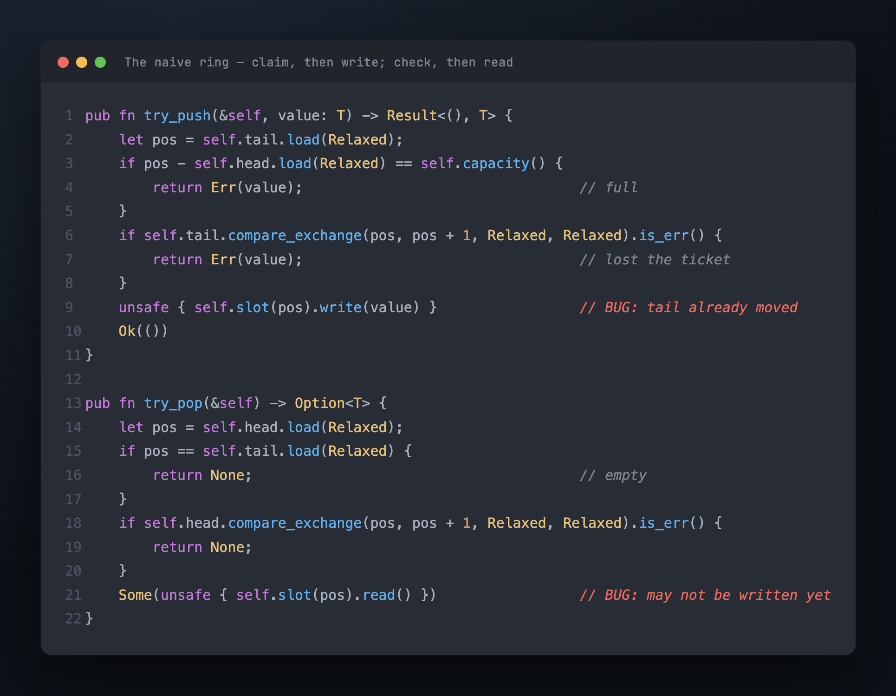
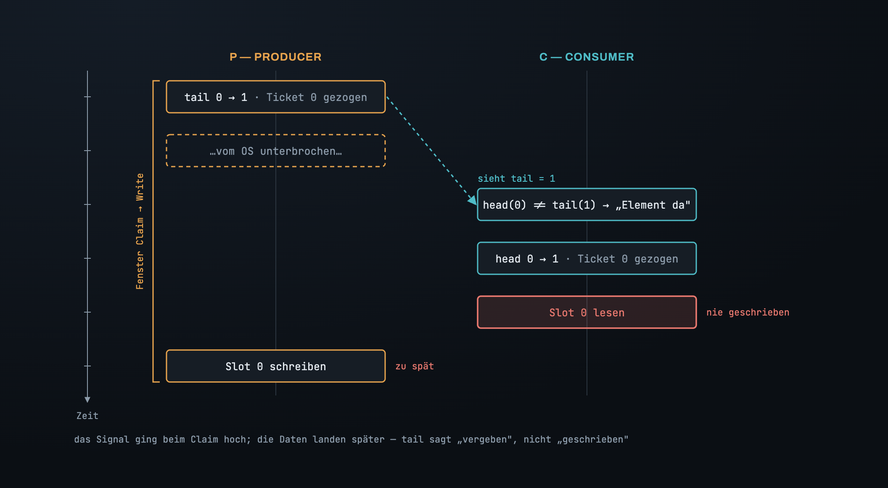
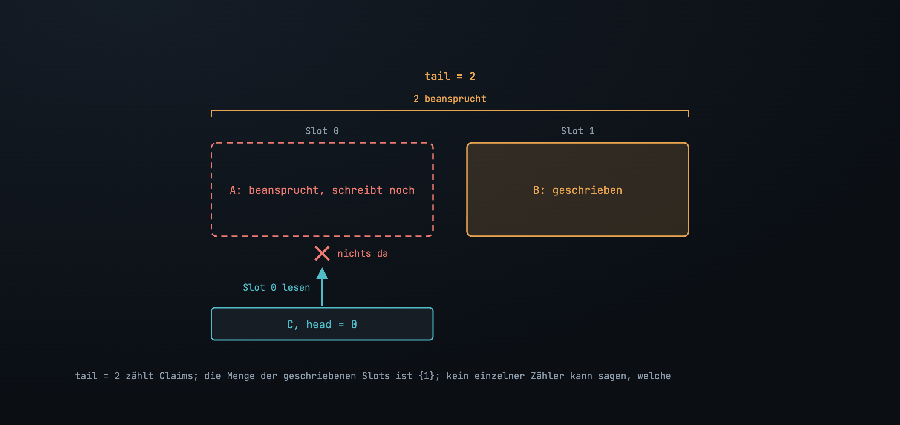
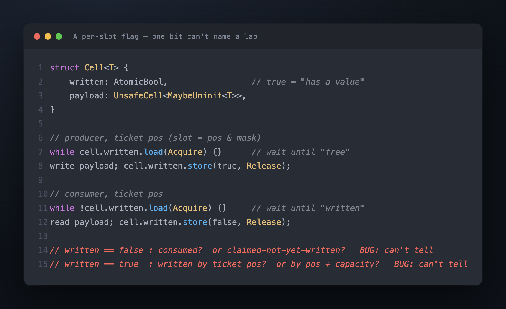
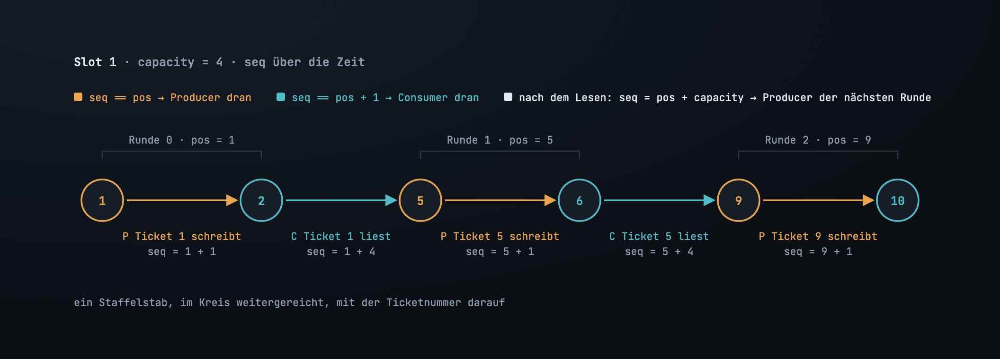
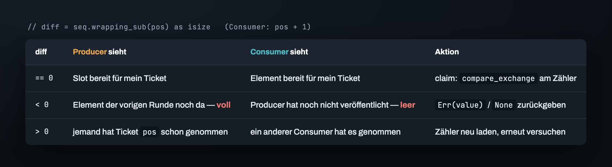
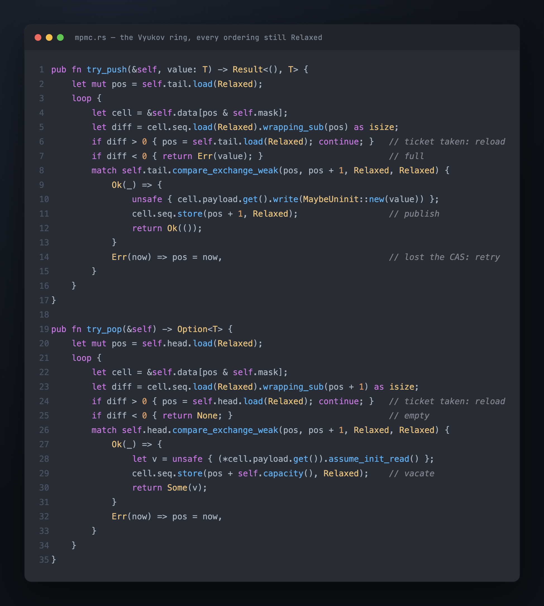

# Teil 2 — Ein Zähler kann nicht „geschrieben" sagen

Hier ist der Ring aus Teil 1 mit dem naheliegenden Push und Pop. Ein Producer liest
`tail`, prüft, dass der Ring nicht voll ist, beansprucht das Ticket mit einem
`compare_exchange` und schreibt seinen Wert nach `data[ticket & mask]`. Ein Consumer
liest `head`, prüft `head != tail`, beansprucht das Ticket auf dieselbe Weise und liest
den Slot.



Auf einem einzigen Thread besteht er alles. Drei pushen, drei poppen, sie kommen der
Reihe nach heraus; pushen, bis er voll ist, `Err`; poppen, bis er leer ist, `None`.
Jetzt lass einen Producer gegen einen Consumer laufen.

## Beanspruchen ist nicht Veröffentlichen

Das `compare_exchange` des Producers bewegt `tail` von 0 auf 1 in dem Moment, in dem
das Ticket *beansprucht* wird — und dann wird der Producer vom OS unterbrochen, noch
vor dem Write:

```
    tail = 0, head = 0

P:  tail 0 → 1                 (Ticket 0 beansprucht; Slot 0 noch leer)
P:  …vom OS unterbrochen…
                          C:   head(0) != tail(1)   →  „da ist ein Element"
                          C:   head 0 → 1
                          C:   Slot 0 lesen         →  nie geschrieben
P:  Slot 0 schreiben           (zu spät)
```

Der Consumer hat nichts falsch gemacht. Er hat dem einzigen Signal vertraut, das er
hatte, und das Signal wurde beim Claim gesetzt, nicht beim Write. Dass `tail` sich bewegt,
heißt: *Jemand besitzt Ticket 0*. Es heißt nicht, dass im Slot von Ticket 0
irgendetwas drin ist.



## Zwei Producer machen es strukturell

Mit zwei Producern ist die Lücke kein Wettlauf mehr, sondern eine Tatsache über
Zähler:

```
A:  tail 0 → 1   (Slot 0)
B:  tail 1 → 2   (Slot 1)
B:  Slot 1 schreiben
                          C:   head(0) != tail(2)   →  „zwei Elemente"
                          C:   Slot 0 lesen         →  A hat ihn nicht geschrieben
A:  Slot 0 schreiben
```

`tail = 2` sagt: Zwei Tickets sind beansprucht. Die Menge der tatsächlich geschriebenen
Slots ist `{1}`. Kein einzelner Zähler kann „Slot 1 ist geschrieben, Slot 0 nicht"
ausdrücken, denn Claims werden der Reihe nach vergeben, und Writes werden in der
Reihenfolge fertig, die dem Scheduler gerade gefällt.



> **`head` und `tail` verteilen, wer an der Reihe ist. Den Zustand eines Slots können
> sie nicht beschreiben. Diese Information muss im Slot leben.**

## Ein Boolean hat kein Gedächtnis

Also ein Flag in den Slot: `written: AtomicBool`. Der Producer schreibt, setzt es auf
`true`. Der Consumer wartet auf `true`, liest, setzt es auf `false`. Zwei Producer
können es nicht durcheinanderbringen, denn jeder fasst nur seinen eigenen Slot an.

Es überlebt eine Runde. Ein Ring mit zwei Slots und ein langsamer Producer, der Ticket 0
hält:

```
P0: tail 0 → 1  (Slot 0)  …langsam…
P1: tail 1 → 2  (Slot 1), schreiben, written = true
                                  C1: Slot 1 lesen, written = false
P2: tail 2 → 3  (wieder Slot 0 — Runde 2)
P2: Slot 0 sagt written = false  →  „frei"  →  schreiben, written = true
                                  C0: Slot 0 sagt written = true → lesen  (bekommt P2s Element als Element 0)
P0: Slot 0 schreiben              (überschreibt P2s Element; Reihenfolge und Inhalt beide falsch)
```

`written = false` hieß „konsumiert" *oder* „beansprucht, aber noch nicht geschrieben",
und P2 kann die beiden nicht auseinanderhalten. `written = true` hieß „von Ticket 0
geschrieben" *oder* „von Ticket 2 geschrieben", und C0 kann sie nicht auseinanderhalten.
Das Flag meldet einen Zustand; es meldet nicht, *wessen*. Dieselbe Sackgasse, in die der
SeqLock in [seinem Teil 2](../../seqlock/de/02_the_bet.md) geraten ist: Ein Boolean hat
kein Gedächtnis, und ein Slot, der über Runden hinweg wiederverwendet wird, braucht
eines.



## Die Sequenz: ein Staffelstab mit einer Nummer darauf

Der Fix stammt von Dmitry Vyukov, und er besteht aus einem Integer pro Slot: `seq`. Er
sagt nicht „frei" oder „voll". Er sagt, **für welches Ticket der Slot bereit ist**, und
diese Zahl geht immer nur nach oben.

- Slot `i` startet mit `seq = i` — bereit für den Producer, der Ticket `i` hält.
- Der Producer mit Ticket `pos` darf schreiben, wenn `seq == pos`. Nach dem Schreiben
  speichert er `seq = pos + 1`: bereit für den *Consumer*, der Ticket `pos` hält.
- Der Consumer mit Ticket `pos` darf lesen, wenn `seq == pos + 1`. Nach dem Lesen
  speichert er `seq = pos + capacity`: bereit für den *nächsten Producer*, der auf
  diesen Slot abgebildet wird und konstruktionsbedingt Ticket `pos + capacity` hält.



Der Slot reicht einen Staffelstab im Kreis weiter, und auf dem Staffelstab steht die
Ticketnummer. P2 aus der Boolean-Geschichte findet auf Slot 0 jetzt `seq = 0` — nicht
`2` — und weiß, dass Ticket 0 noch nicht einmal geschrieben ist, geschweige denn
konsumiert. C0 findet `seq = 0`, nicht `1`, und weiß, dass sein Element nicht da ist.
Keine Runde wird je für eine andere gehalten.

## Das Drei-Wege-Gate

Der Vergleich ist eine vorzeichenbehaftete Differenz, `seq.wrapping_sub(pos) as isize`,
damit er aussagekräftig bleibt, falls die Zähler je überlaufen. Für einen
Producer bei Ticket `pos`:

- **`diff == 0`** — der Slot ist bereit für mich. Ticket beanspruchen.
- **`diff < 0`** — `seq` steht noch auf `pos - capacity + 1`: Das Element der vorigen
  Runde liegt im Slot, unkonsumiert. Der Ring ist **voll**. `Err(value)` zurückgeben.
- **`diff > 0`** — irgendein Producer hat Ticket `pos` schon genommen und `seq` darüber
  hinausgeschoben. Mein `pos` ist veraltet. `tail` neu laden und das nächste Ticket
  versuchen.

Das Gate des Consumers ist das Spiegelbild: gegen `pos + 1` vergleichen; `diff < 0`
heißt **leer** (der Producer hat noch nicht veröffentlicht), `diff > 0` heißt, ein
anderer Consumer war schneller.



Das Gate wird *vor* dem `compare_exchange` auf dem Zähler gelesen, und das muss so sein:
Ein einmal genommenes Ticket kannst du nicht zurückgeben, also musst du vorher wissen,
dass der Slot benutzbar ist. Das weckt eine naheliegende Sorge — der Slot könnte sich
zwischen Gate und Claim ändern. Kann er nicht, jedenfalls nicht auf die eine Art, auf
die es ankommt. Nur der Producer, der Ticket `pos` hält, kann `seq` von `pos` auf
`pos + 1` bewegen, und wenn mein CAS auf `tail` von `pos` aus gelingt, dann bin ich
dieser Producer. Ein erfolgreicher Claim beweist im Nachhinein, dass der Gate-Read
aktuell war.

## Der Vertrag: `try` heißt versuchen

Die letzte Frage ist, was zu tun ist, wenn etwas nicht bereit ist, und es gibt zwei
Fälle, die gleich aussehen und es nicht sind.

**CAS verloren.** Ein anderer Thread hat Ticket `pos` genommen. Das nächste Ticket ist
frei, niemand muss etwas tun, damit ich es bekomme, also läuft die Schleife mit dem
neuen `tail` weiter. Hier in der Schleife zu bleiben ist ein Wettlauf, den ich allein
gewinnen kann.

**Voll oder leer.** Fortschritt braucht jemand anderen — einen Consumer, der einen Slot
leert, einen Producer, der einen füllt. Bleibt das Primitiv hier in einer
Spin-Schleife, ist es zu einer blockierenden Queue mit Umwegen geworden, und zu einer
schlechteren: Ein Producer, der mitten im Write vom OS verdrängt wird, hält jeden
Consumer hinter sich in einer Spin-Schleife fest. Also kehrt es zurück. Was mit dem
„Nein" geschieht, entscheidet der Aufrufer.

> **Bleib in der Schleife bei den Wettläufen, die du allein gewinnen kannst. Kehr zurück
> bei denen, die jemand anderen brauchen.**

Eine Konsequenz, die man aussprechen sollte: `try_pop` gibt `None` zurück, wenn das
Element *am Head* nicht veröffentlicht ist, selbst wenn spätere Slots es sind. Consumer
springen nicht vor. Genau das hält den Ring FIFO, und das ist der Preis dafür.



Das ist der Ring. Er verteilt über zwei Zähler, wer an der Reihe ist, und übergibt Daten
über eine Sequenz pro Slot; er ist beschränkt, allokationsfrei, lock-free, und er kehrt
zurück, statt zu warten. Lass ihn unter Miri laufen, jedes Ordering `Relaxed` — wie
gezeigt —, und Miri meldet einen Data Race auf dem payload. Die Logik stimmt. Falsch ist
das eine, was die Logik nicht kontrolliert: die Reihenfolge, in der zwei Cores
Änderungen im Speicher sehen. Das ist Teil 3.

---

*Weiter: [Teil 3 — Das Memory Ordering richtig hinbekommen](03_memory_ordering.md) · [Index](00_index.md)*

*English: [`../en/02_the_sequence.md`](../en/02_the_sequence.md)*
