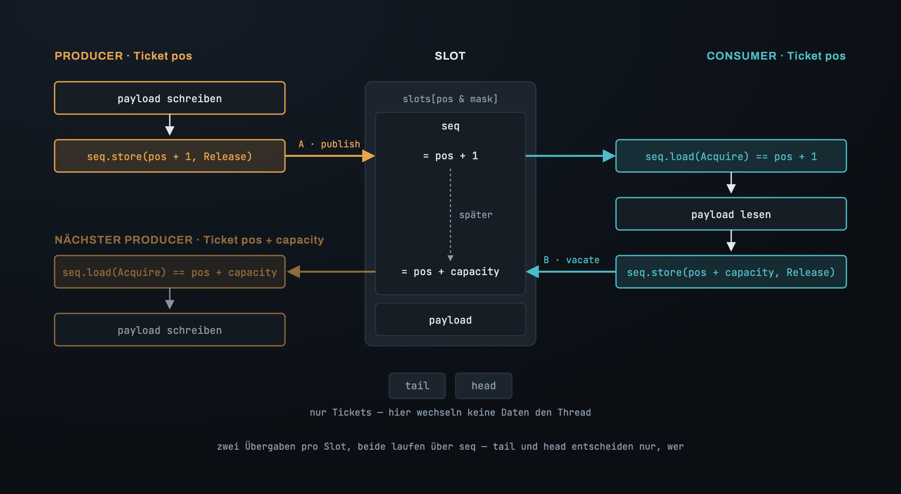
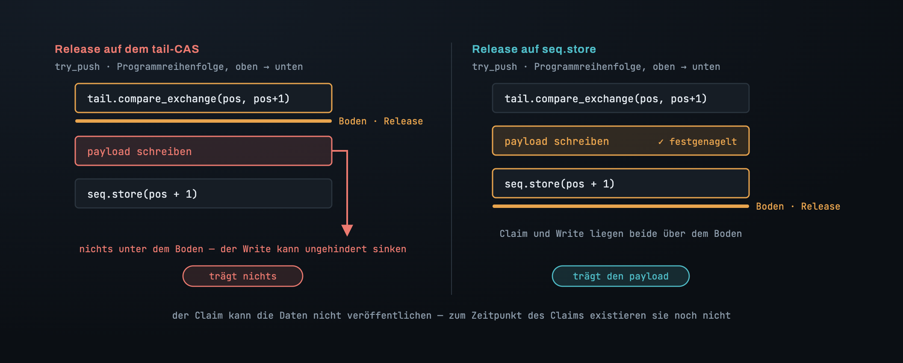
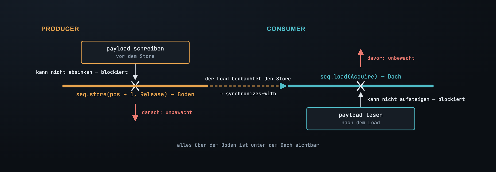
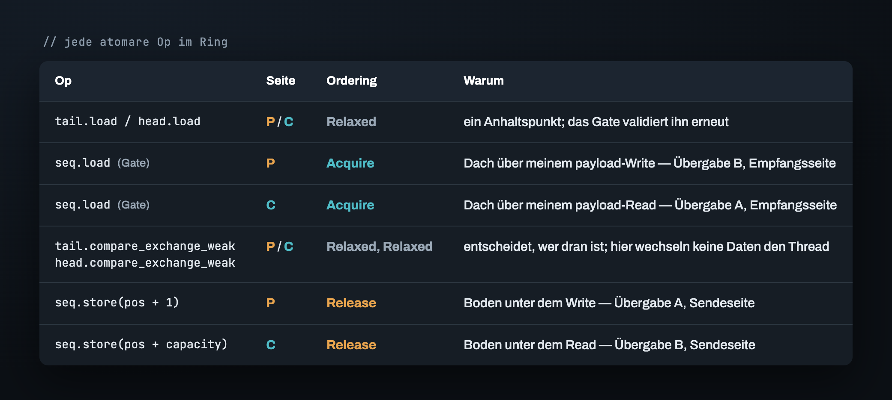
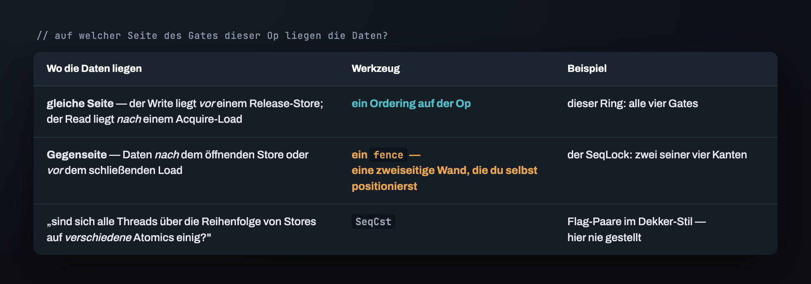

# Teil 3 — Das Memory Ordering richtig hinbekommen

Am Ende von Teil 2 war der Ring logisch korrekt, und jede atomare Operation darin war
`Relaxed` — atomar, aber ohne jedes Versprechen über die Reihenfolge. Lass die Tests
unter Miri laufen, und das kommt zurück:

Die zwei Zugriffe, die es nennt, sind der payload-Write in `try_push` und der
payload-Read in `try_pop`. Verschiedene Threads, dieselben Bytes, und nichts, was den
einen vor den anderen ordnet. Auf dem M2 ist das Symptom ein Consumer, der gelegentlich
den vorherigen Inhalt des Slots liest; in Rusts Memory-Modell ist es undefiniertes
Verhalten, noch bevor es ein falscher Wert ist. Die Logik sagt: Der Consumer liest
erst, nachdem der Producer veröffentlicht hat. Die Hardware hat von der Logik nie
gehört.

Dieser Teil platziert jedes Ordering per Argument, nicht per Ausprobieren. Das Argument
hat drei Schritte: finden, wo Daten von einem Thread zum anderen wandern; entscheiden,
welches Atomic jeden dieser Übergänge trägt; und dann `Release` und `Acquire` auf die
Seite dieses Atomics legen, die die Daten tatsächlich abdeckt.

## Wo die Daten den Thread wechseln

Ein normaler (nicht-atomarer) Write auf einem Thread und ein normaler Read derselben
Bytes auf einem anderen brauchen ein *happens-before* zwischen sich, und es gibt genau
einen Weg, eines über Threads hinweg zu bauen: einen `Release`-Store auf der
schreibenden Seite, einen `Acquire`-Load **desselben Atomics** auf der lesenden Seite,
und der Load muss diesen Store beobachten. Alles vor dem `Release` happens-before dann
alles nach dem `Acquire`.

Die Aufgabe ist also, jede Stelle aufzulisten, an der der Ring so ein Paar hat. Pro
Slot gibt es zwei:

- **A — publish.** Der Producer schreibt den payload; der Consumer liest ihn.
- **B — vacate.** Der Consumer liest den payload; der Producer der *nächsten Runde*
  überschreibt ihn. Bytes zu überschreiben, die ein anderer Thread vielleicht noch
  liest, ist genauso ein Data Race.

Jede davon ist eine *Übergabe*: Ein Thread ist mit den Bytes fertig und signalisiert
das, der andere nimmt sie auf — eine Sendeseite und eine Empfangsseite. Zwei Übergaben,
also zwei `Release`/`Acquire`-Paare. Die Frage ist, über welches Atomic jedes Paar
läuft — und der Ring hat drei Kandidaten: `tail`, `head` und das `seq` des Slots.

## Warum der payload über `seq` läuft, nicht über den Zähler

Der Instinkt sagt: der Zähler. Der Consumer liest erst, nachdem er gesehen hat, dass das
Ticket des Producers beansprucht wurde — also veröffentliche über den Claim: Mach das
`compare_exchange` auf `tail` zu einem `Release`. Das kann nicht funktionieren, und der
Grund ist die Programmreihenfolge.

`Release` ist ein **Boden unter allem, was davor kommt**. In `try_push` läuft der CAS
auf `tail` *vor* dem payload-Write — genau das war das ganze Problem in Teil 2. Ein
`Release` auf diesem CAS hat nichts unter sich. Der Write liegt immer noch über dem
Boden und kann ungehindert hindurchsinken.

Der `seq`-Store läuft *nach* dem Write. Ein `Release` dort hat den Write unter sich. Das
ist der einzige Store im Producer, der den payload tragen kann, und es ist derselbe, auf
den das Gate des Consumers ohnehin schon wartet.

> **Der Claim kann die Daten nicht veröffentlichen, denn zum Zeitpunkt des Claims
> existieren die Daten noch nicht. Die Veröffentlichung gehört dem letzten Store nach
> dem Write — `seq`.**

Beide Übergaben landen auf `seq`. Übergabe A ist das `seq.store(pos + 1)` des Producers,
gelesen vom Gate des Consumers. Übergabe B ist das `seq.store(pos + capacity)` des
Consumers, gelesen vom Gate des nächsten Producers. Die Zähler tragen nichts als
Tickets.

## Boden und Dach

Beide Orderings sind einseitig, und es lohnt sich, genau festzuhalten, welche Seite.

`Release` auf einem Store ist ein Boden unter allem, was in der Programmreihenfolge
davor kommt: Nichts darüber darf unter den Store sinken. Über das, was danach kommt,
sagt es nichts. `Acquire` auf einem Load ist ein Dach über allem, was danach kommt:
Nichts darunter darf über den Load aufsteigen. Über das, was davor kommt, sagt es
nichts. Liest der `Acquire`-Load den Wert, den der `Release`-Store geschrieben hat,
rasten die beiden Hälften ineinander: Was über dem Boden lag, ist jetzt garantiert
unter dem Dach sichtbar.

Das ist das ganze Werkzeug. Platziere es, indem du an jeder atomaren Op fragst: *Auf
welcher Seite liegen die Daten, und deckt das Gate dieser Op diese Seite ab?*

## Jedes Ordering platzieren

Geh `try_push` von oben nach unten durch.

1. `tail.load` — ein Anhaltspunkt. Das Gate validiert ihn erneut, und ein veralteter
   Wert kostet einen zusätzlichen Schleifendurchlauf. **`Relaxed`.**
2. `seq.load`, das Gate. Danach wird dieser Thread den payload *schreiben*. Dieser Write
   darf nicht beginnen, bevor der Read des vorherigen Consumers auf dieselben Bytes
   abgeschlossen ist — Übergabe B. Der Consumer hat seinen Read mit einem `Release` auf
   dem `vacate`-Store veröffentlicht; dieser Load muss das Dach sein, das meinen Write
   unter sich hält. **`Acquire`.**
3. `tail.compare_exchange_weak` — entscheidet, *wem* das Ticket gehört, und sonst
   nichts. Der Slot wurde schon in (2) geprüft; der payload wird in (5) veröffentlicht.
   Auf dieser Op wechseln keine Daten den Thread. **`Relaxed`, Erfolg wie Fehlschlag.**
4. Der payload-Write. Ein normaler Write.
5. `seq.store(pos + 1)` — der Boden unter (4). Die Sendeseite von Übergabe A.
   **`Release`.**

`try_pop` ist das Spiegelbild. `head.load` ist ein Anhaltspunkt, `Relaxed`. Das
`seq`-Gate ist das Dach über dem payload-Read, der folgt — die Empfangsseite von
Übergabe A — `Acquire`. Der `head`-CAS entscheidet, wer dran ist, `Relaxed`. Der Read
bleibt normal. Der `vacate`-Store `seq.store(pos + capacity)` ist der Boden unter diesem
Read — die Sendeseite von Übergabe B — `Release`.

## Der CAS ist mit Absicht `Relaxed`

Bei (3) zucken die Leute zusammen. Der payload-Zugriff sitzt im `Ok`-Zweig des CAS —
sollte das, was entscheidet, ob du den Slot anfassen darfst, nicht auch das Anfassen
ordnen?

Atomarität ist nicht Ordering. `compare_exchange` garantiert, dass das
Read-Modify-Write unteilbar ist — keine zwei Threads nehmen Ticket `pos`. Darüber, wann
der payload für irgendwen sichtbar wird, sagt es nichts, und das muss es auch nicht: Der
Zugriff hat bereits ein Dach und einen Boden — das `Acquire` in (2), das ihm vorausgeht,
und das `Release` in (5), das ihm folgt. Der CAS sitzt zwischen zwei Gates, die die
Arbeit erledigen. Ein `AcqRel` darauf würde nichts einbringen und bei jedem Claim eine
Barriere kosten — auf aarch64 ein `casal`, wo ein `cas` reicht.

## Warum kein Fence — der Unterschied zum SeqLock

Der [SeqLock](../../seqlock/de/03_memory_ordering.md) brauchte zusätzlich zu seinen
Orderings zwei eigenständige `fence`s. Dieser Ring braucht keinen einzigen, und der
Grund ist der Test aus dem Abschnitt über Boden und Dach.

Frag an jedem der vier Gates, auf welcher Seite die Daten liegen. Der Write des Producers
liegt *vor* seinem `Release`-Store — und *davor* ist genau das, was `Release` abdeckt.
Der Read des Consumers liegt *nach* seinem `Acquire`-Load — und *danach* ist genau das,
was `Acquire` abdeckt. Vier Gates, viermal die Antwort „gleiche Seite". Ein Ordering
auf der Op erreicht alles, was es erreichen muss.

Beim SeqLock legten zwei der vier Kanten den payload auf die Gegenseite: Die
payload-Stores des Writers kamen *nach* dem öffnenden Bump, und die Kopie des Readers
kam *vor* der schließenden Prüfung. Kein Ordering auf diesen Ops konnte die Daten
erreichen. Ein Fence — eine zweiseitige Wand, die du selbst positionierst, kein an eine
Op geklebtes Gate — war das einzige Werkzeug.

Es gibt eine dritte Stufe, `SeqCst`, für den Fall, dass die Frage nicht lautet „sieht
dieser Thread die Daten jenes Threads", sondern „sind sich alle Threads über die
Reihenfolge von Stores auf *verschiedene* Atomics einig". Der Ring stellt sie nie. Jede
Übergabe ist ein Atomic, eine Richtung. Jedes Ordering oben wurde per Argument
platziert. Die All-`Relaxed`-Version auch — das Argument war, dass die Tests
durchliefen. Teil 4 zeigt, wie man ein Argument prüft: zwei Werkzeuge, von denen eines
dir sagen wird, der falsche Ring sei in Ordnung.

---

*Weiter: [Teil 4 — Der Beweis: zwei Werkzeuge und ein lügendes Grün](04_proving_it.md) · [Index](00_index.md)*

*English: [`../en/03_memory_ordering.md`](../en/03_memory_ordering.md)*
