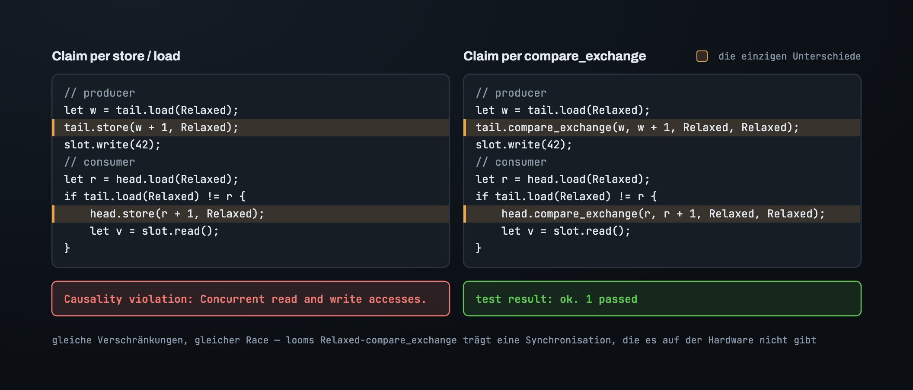
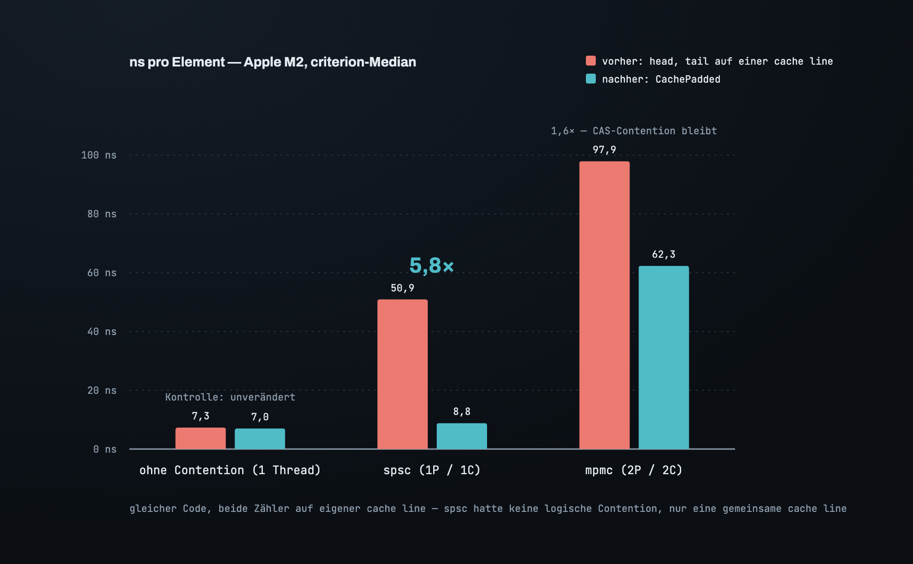

# Teil 4 — Der Beweis: zwei Werkzeuge und ein lügendes Grün

Teil 3 hat jedes Ordering per Argument platziert. Der All-`Relaxed`-Ring hatte auch
ein Argument — die Tests liefen durch —, also ist ein Argument kein Beweis. Drei Fragen
sind noch offen, und sie brauchen drei verschiedene Instrumente:

1. *Reicht `Relaxed` hier, und wenn nicht, welches Ordering?* — die Argumentation aus
   Teil 3.
2. *Habe ich undefiniertes Verhalten geschrieben?* — Miri.
3. *Hält es unter jeder Verschränkung?* — loom.

Jedes ist blind für etwas, das die anderen sehen. Das Interessante ist loom, denn es
winkt einen kaputten Ring durch und meldet das in Grün.

## Miri: der Race, beim Namen genannt

Miri interpretiert das kompilierte Programm und verfolgt jedes Byte: wer es geschrieben
hat, auf welchem Thread, mit welchem Ordering und ob der Read danach ein happens-before
zum Write hat. Auf dem All-`Relaxed`-Ring bleibt es beim ersten payload-Read stehen,
der keins hat — die Karte am Anfang von Teil 3. Data Race, die zwei Threads, der Typ an
der Adresse: `MaybeUninit<usize>`. Diese Präzision ist der Grund, warum Miri zuerst
drankommt. Es fängt auch die anderen Dinge, die eine Queue mit Speicher falsch machen
kann — einen uninitialisierten Read, ein Leak, ein Double Free — und Spin-Schleifen
stören es nicht.

Was Miri nicht tut, ist aufzählen. Es führt die Verschränkungen aus, die es nun mal
ausführt, mit ein paar eingestreuten Unterbrechungen. Ein Race, der einen bestimmten
Schedule braucht, kann durchrutschen.

## loom: eine Explosion statt einer Antwort

loom führt einen kleinen Test unter *jeder* Verschränkung aus, die das Memory-Modell
erlaubt, innerhalb einer Schranke. Es modelliert auch die Orderings: Ein `Relaxed`-Load
darf einen Wert liefern, den der speichernde Thread vor einer Weile geschrieben hat, und
loom erkundet den Schedule, in dem er das tut.

Auf dem All-`Relaxed`-Ring ist loom nicht fehlgeschlagen. Es hat aufgegeben:

Das ist ein Urteil, nur ein indirektes. Die Gate-Schleife aus Teil 2 — `diff > 0`,
Zähler neu laden, erneut versuchen — geht davon aus, dass das Neuladen irgendwann einen
frischen Wert sieht. Unter `Relaxed` sagt nichts, dass es das muss; ein veralteter Wert
ist für immer legal, also ist der Pfad, auf dem die Schleife nie terminiert, ein echter
Pfad, und loom folgt ihm, bis sein Branch-Budget aufgebraucht ist. Setz die Orderings
aus Teil 3 ein, und die Schedules, in denen der Wert ewig veraltet bleibt, sind nicht
mehr legal. Das Modell hat nur noch endlich viele Pfade — und ist grün. loom sagt dir
auf seine Weise, dass der *Fortschritt* deiner Schleife auf einem Ordering ruhte, das
du nicht geschrieben hattest.

Der Test muss mitspielen. Eine Contention-Achse pro Modell — zwei Producer und ein
Consumer oder zwei Consumer und ein Producer, nie alles auf einmal — eine Kapazität von
zwei, die Producer gejoint, bevor der Consumer den Ring leert, und jeder Retry im
Testcode beschränkt. Der payload-Zugriff läuft über `loom::cell::UnsafeCell`, damit
loom ihn sieht, hinter einem `cfg(loom)`-Shim, der `loom`s Atomics einwechselt.

## Das lügende Grün

Drei loom-Modelle, drei Grüns. Zeit, nicht länger zu vertrauen, sondern nachzubohren:
Gib loom den *naiven* Ring aus Teil 2 — den, der auf `tail` beansprucht und erst danach
schreibt, und von dem wir wissen, dass er einen Slot liest, bevor er geschrieben ist.

Grün.

Jetzt die Probe aufs Exempel. Eine minimale Übergabe, alles `Relaxed`: Der Producer
beansprucht einen Zähler und schreibt dann den Slot; der Consumer sieht den Zähler
weiterrücken, beansprucht seine Seite und liest den Slot. Mit `store`/`load`
geschrieben, sagt loom genau das, was es soll: *Causality violation: concurrent read and
write accesses.* Stell die beiden Claims auf `compare_exchange` um — gleiche
Verschränkungen, gleicher Race — und loom läuft durch.

looms Modell eines `Relaxed`-`compare_exchange` ist stärker als das der Hardware. Eine
Übergabe, deren Empfangsseite über einen CAS läuft, bekommt von loom eine
Synchronisation, die ihr ein M2 nicht geben wird. Also:

> **loom kann einen Race nicht sehen, der über ein Compare-and-Swap läuft. Sein Grün ist
> nur ein Beleg für Übergaben, die über einen einfachen Store und Load gehen.**

Ein Grund mehr, warum das Design aus Teil 3 jede Übergabe durch `seq` leitet — ein
Store und ein Load — und den CAS für das behält, was er kann: entscheiden, wer. Hätten
wir über den CAS des Zählers veröffentlicht, hätte loom es abgesegnet. Miri nicht.

## Die Arbeitsteilung

Die Argumentation entscheidet, welches Ordering und warum, und ist blind für das, woran
du nicht gedacht hast. Miri findet das UB, das du tatsächlich geschrieben hast, und ist
blind für den Schedule, den es nicht ausgeführt hat. loom führt jeden Schedule aus, ist
blind für Übergaben über einen CAS und kann eine Schleife nicht terminieren, deren
Fortschritt an einem fehlenden Ordering hängt. Jedes für sich allein hätte einen
falschen Ring durchgelassen. Die drei zusammen nicht.

## Drop: dem Ring gehört, was drin ist

Noch etwas, worauf Miri achtet. `Box<[Cell<T>]>` droppt die Zellen, aber eine Zelle
hält ein `MaybeUninit<T>`, und das droppt nichts — es kann nicht wissen, ob es einen
Wert hält. Elemente, die beim Drop noch im Ring liegen, leaken.

Der Fix ist wieder dasselbe Gate: `impl Drop` leert den Ring mit `try_pop` und droppt
jedes Element. Das funktioniert nach beliebig vielen Runden, weil `try_pop` ohnehin
weiß, welche Slots einen Wert halten. Unter Miri, dessen Leak-Checker standardmäßig an ist:
ein payload mit einer `Box` drin und einem Drop-Zähler, drei gepusht, eins gepoppt, Ring
gedroppt — genau drei Drops. Fünf gepusht und vier gepoppt über die Rundengrenze eines
Zwei-Slot-Rings hinweg — genau fünf.

## Die letzten Nanosekunden: False Sharing

Der Ring ist korrekt. Jetzt die Zahl. `criterion` auf dem M2, ein Element pro
Iteration gepusht und gepoppt:

- ein Thread, erst push, dann pop — **~7,3 ns**.
- ein Producer-Thread, ein Consumer-Thread — **~51 ns**.

Das Siebenfache der Ein-Thread-Kosten, für eine Übergabe, die laut Teil 1 *keine*
logische Contention hat: ein Schreiber pro Slot, ein Leser pro Slot und die beiden
Zähler von verschiedenen Threads angefasst.

Von verschiedenen Threads angefasst — und direkt nebeneinander. `head` und `tail` sind
zwei benachbarte `AtomicUsize` — sechzehn Bytes, eine cache line. Der Producer schreibt
`tail`, und das invalidiert die Kopie der cache line auf dem Consumer-Core. Der Consumer
schreibt `head`, und das invalidiert die des Producers. Keiner der beiden Threads liest
auf dem Hot Path je den Zähler des anderen, und trotzdem zahlen sie für die Writes des
jeweils anderen. Das ist False Sharing, und der Fix ist, jeden Zähler auf seine eigene
cache line zu legen: `CachePadded`, 128 Bytes auf Apple Silicon, wo der Prefetcher
cache lines paarweise holt.

Die Single-Producer/Single-Consumer-Übergabe geht von ~51 ns auf ~8,8 ns — 5,8×, und
liegt jetzt keine zwei Nanosekunden über der Ein-Thread-Untergrenze. Zwei Producer und
zwei Consumer gehen von ~98 auf ~62; was dort übrig bleibt, ist echte Contention auf dem
CAS der Zähler, und die nimmt kein Padding weg. Die Kontrolle, ein Thread, der beides
macht, geht von 7,3 auf 7,0 — Rauschen — und genau das sagt dir, dass der Gewinn vom
Padding kommt und nicht vom Lauf.

Auch noch das `seq` jedes Slots zu padden ist der naheliegende nächste Schritt — und
lohnt sich nicht: Es vervierfacht den Speicher eines Rings mit kleinen payloads, um den
letzten 1,8 ns hinterherzujagen.

Das ist der Ring. Zwei Zähler, die Reihen vergeben, eine Sequenz pro Slot, die den
Staffelstab mit Ticketnummer drauf weiterreicht, vier Orderings, platziert je nachdem,
wo die Daten liegen, drei Instrumente, von denen jedes fängt, was die anderen verpassen,
und zwei cache lines, wo eine 40 Nanosekunden gekostet hat.

---

*[Index](00_index.md)*

*English: [`../en/04_proving_it.md`](../en/04_proving_it.md)*
