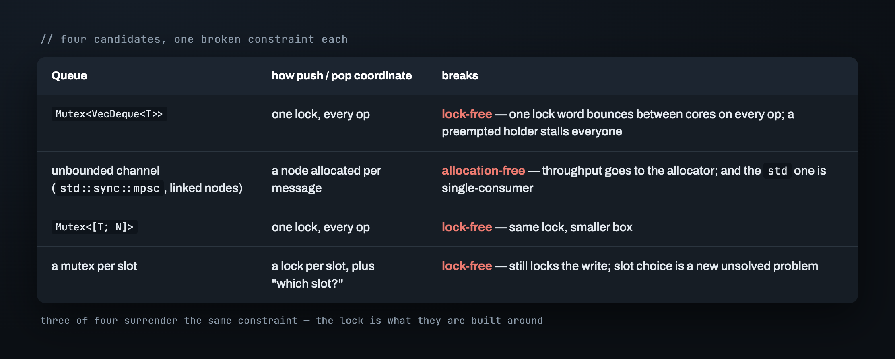
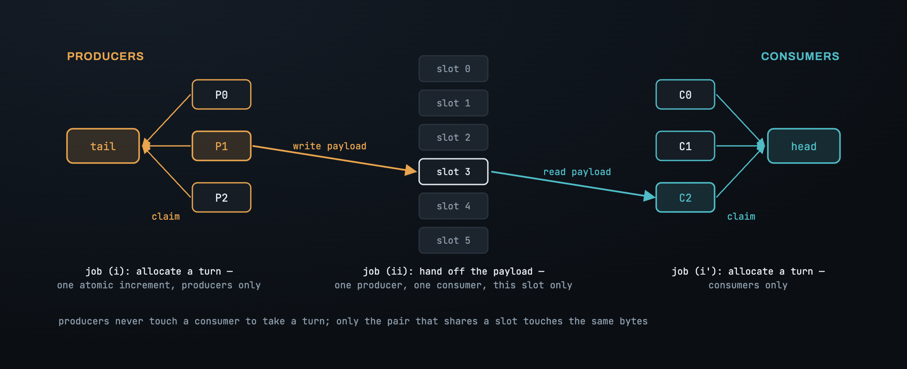
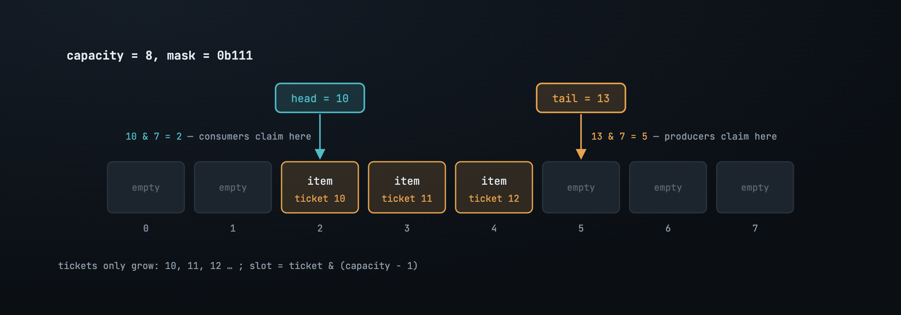

# Part 1 — The problem, and why the obvious queues don't fit

Twelve feed handlers, one per core, each pulling orders off a different exchange
session and pushing them into one place: the matching engine's intake. On the other
side, a pool of matching threads pops from that same intake. A few million operations a
second, from both ends at once, and no thread on either side can afford to stop — a
feed thread that stalls drops market data; a matcher that stalls widens the spread on
every symbol queued behind it. In the middle of the hottest path in the system sits a
queue, and the first thing anyone reaches for is `Mutex<VecDeque<T>>`.

The shape is everywhere fast software has a write end. A write-ahead log fans a dozen
writer threads into one group commit. A metrics pipeline funnels samples from every
worker into one aggregator. Same object each time: **many threads push, many threads
pop, on the hot path, at a rate where the queue's own overhead is the budget.**

## Three constraints, not one

If throughput were the only requirement this would be a benchmark, not a design
problem. It's a design problem because the queue has to hold three things at once:

- **Bounded and allocation-free.** A fixed buffer, sized once. No `Box` per message,
  no linked node allocated on push and freed on pop. An allocator call is hundreds of
  nanoseconds on a good day and a process-wide lock on a bad one; either way it doesn't
  fit inside a hand-off that has to complete in under a microsecond.
- **Lock-free.** No single word every thread must acquire. The guarantee we want is
  that at any moment *some* thread is making progress, and a thread the OS preempts
  mid-operation — holding nothing — cannot freeze the rest.
- **Many-to-many, and non-blocking.** N producers, M consumers, no fixed roles. And a
  `try_` API: `try_push` on a full ring hands the value back; `try_pop` on an empty
  ring returns `None`. The queue never parks a thread. Blocking is a policy the caller
  may want, and it must not be baked into the primitive.

Hold every candidate below against those three. Each one is correct, and each one
gives up exactly one.

## The obvious queues, one constraint each

`Mutex<VecDeque<T>>` is what most code ships, and it works. But every `push` and every
`pop` takes the same lock, so the lock word ping-pongs between cores on every single
operation — the MESI protocol invalidating one cache line in every other core, millions
of times a second, even when nobody is logically contending. And the instant the
holder is preempted, every other thread waits for that one thread to be scheduled
again. That is the opposite of lock-free.

An unbounded channel — `std::sync::mpsc`, or any linked-node queue — dodges the single
lock by allocating a node per message. That hands throughput to the allocator, and
`std`'s is single-consumer by name anyway.

A `Mutex` around a fixed array fixes the allocation and keeps the lock. A mutex *per
slot* shrinks the lock without removing it, and adds a problem the design didn't have
before: deciding which slot each thread should head for.

Three of the four surrender the same thing. The lock isn't a detail of these designs;
it's what they're built around. So the question isn't "which lock is cheapest" — it's
what the lock is actually *doing*, and whether that job can be done without it.

## The lock is doing two jobs

Strip the lock away and state what it was standing in for:

> **(i) Decide which thread owns which slot. (ii) Move the payload from the producer
> that fills a slot to the consumer that empties it.**

Those are two different jobs, and a lock conflates them. Look at where the genuine
conflict lives. Two producers both wanting to push don't conflict over *data* — they
conflict over *a turn*. Each needs a distinct slot, and it doesn't matter who gets
which. Two consumers, the same. The only place two threads touch the same bytes is
between the producer that fills slot *k* and the consumer that later empties slot *k* —
one thread on each side, and a different pair for every slot.

A single lock makes every thread wait for both jobs, every time: a producer blocks a
consumer that wants a completely different slot, because they share the lock word. The
whole design falls out of refusing that. Give producers a way to allocate turns among
themselves that never touches a consumer; give consumers the mirror of it; let the
payload hand-off be a per-slot matter between the two threads that share that slot.

## What's left has a shape

A fixed array of slots. One counter, `tail`, that producers atomically read-and-bump
to claim a turn — the value you took is your *ticket*. A second counter, `head`, that
consumers take tickets from the same way. Neither counter ever decreases, so they run
past the array length almost immediately, and a ticket maps to a physical slot by
folding it back: `slot = ticket & (capacity - 1)`.

That `&` is a modulo, but only when `capacity` is a power of two — then
`capacity - 1` is a run of low `1` bits and the mask keeps exactly them. So the
constructor asserts the power of two and stores `mask = capacity - 1` once.

An array, two counters, a mask. Build the push and pop the obvious way — bump the
counter, touch the slot — and it passes every test you write at your desk: one thread
pushing, one popping, every count tallying. Then it tears the first time two threads
touch it for real, for a reason that isn't a bug in the code but a hole in the idea.
That's Part 2.

---

*Next: [Part 2 — One counter can't say "written"](02_the_sequence.md) · [Index](00_index.md)*
