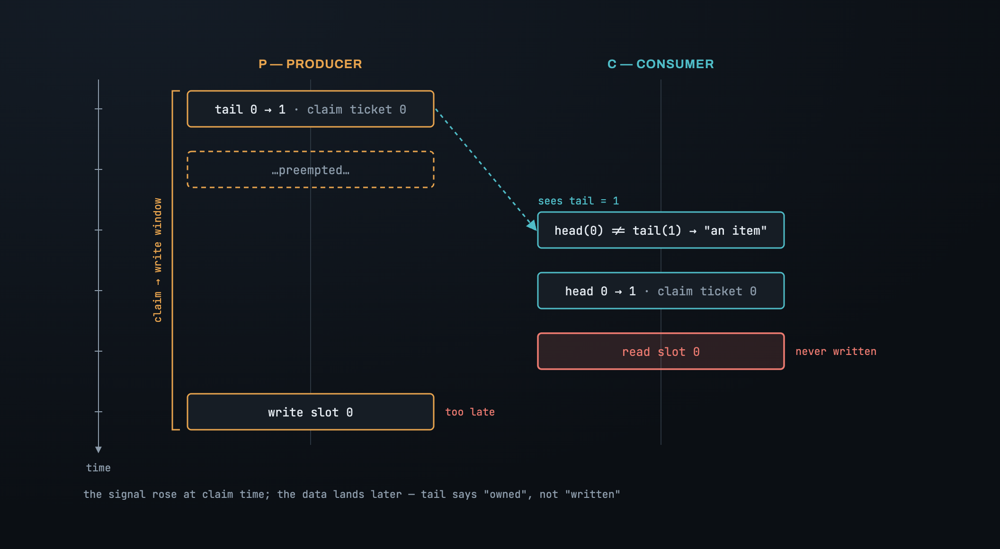
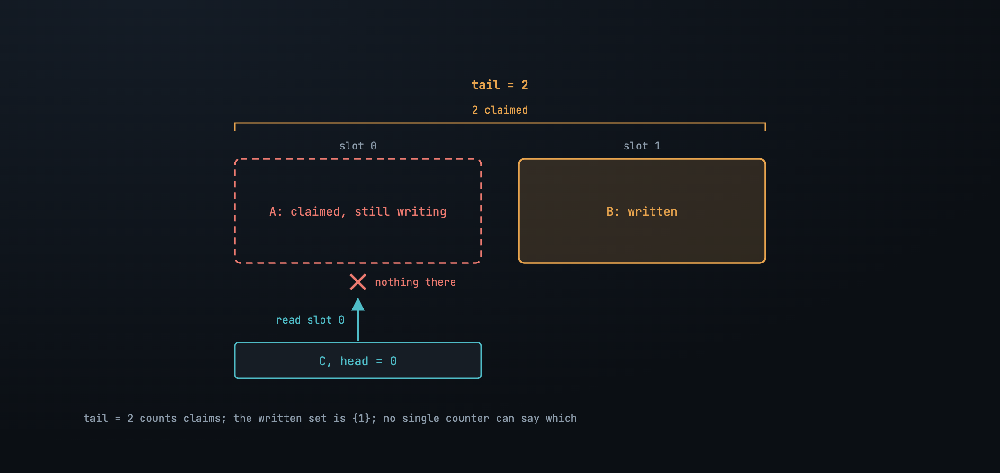
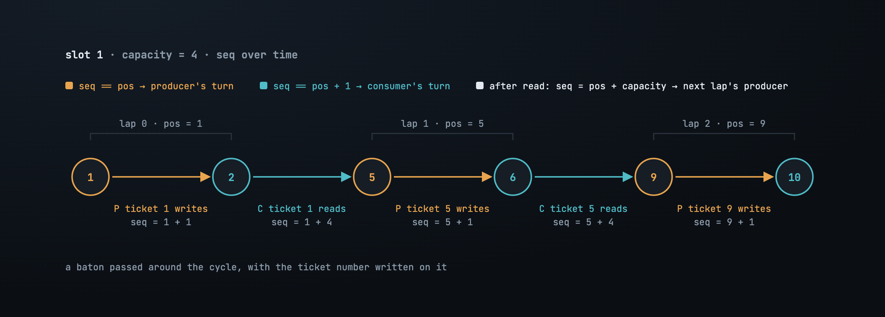
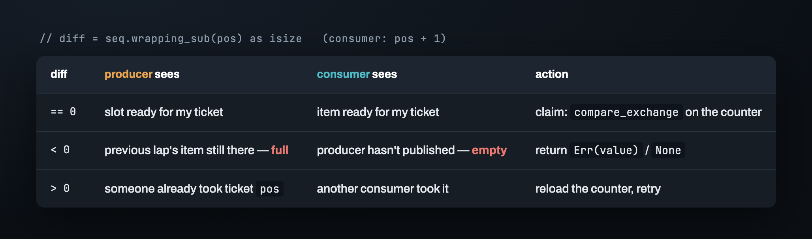

# Part 2 — One counter can't say "written"

Here is the ring from Part 1 with the obvious push and pop. A producer reads `tail`,
checks the ring isn't full, claims the ticket with a `compare_exchange`, and writes its
value into `data[ticket & mask]`. A consumer reads `head`, checks `head != tail`,
claims the ticket the same way, and reads the slot.


Single-threaded, it passes everything. Push three, pop three, they come out in order;
push until full, `Err`; pop until empty, `None`. Now run one producer against one
consumer.

## Claiming is not publishing

The producer's `compare_exchange` moves `tail` from 0 to 1 the moment the ticket is
*claimed* — and then the producer gets preempted, before the write:

```
    tail = 0, head = 0

P:  tail 0 → 1                 (ticket 0 claimed; slot 0 still empty)
P:  …preempted…
                          C:   head(0) != tail(1)   →  "there's an item"
                          C:   head 0 → 1
                          C:   read slot 0          →  never written
P:  write slot 0               (too late)
```

The consumer did nothing wrong. It trusted the only signal it had, and the signal was
raised at claim time, not at write time. `tail` moving means *someone owns ticket 0*.
It does not mean ticket 0's slot has anything in it.



## Two producers make it structural

With two producers the gap stops being a race and becomes a fact about counters:

```
A:  tail 0 → 1   (slot 0)
B:  tail 1 → 2   (slot 1)
B:  write slot 1
                          C:   head(0) != tail(2)   →  "two items"
                          C:   read slot 0          →  A hasn't written it
A:  write slot 0
```

`tail = 2` says two tickets are claimed. The set of slots actually written is `{1}`.
No single counter can express "slot 1 is written, slot 0 isn't", because claims are
handed out in order and writes complete in whatever order the scheduler likes.



> **`head` and `tail` allocate turns. They cannot describe the state of a slot. That
> information has to live in the slot.**

## A boolean has no memory

So put a flag in the slot: `written: AtomicBool`. Producer writes, sets it `true`.
Consumer waits for `true`, reads, sets it `false`. Two producers can't confuse it,
because each only touches its own slot.

It survives one lap. A ring of two slots, and a slow producer holding ticket 0:

```
P0: tail 0 → 1  (slot 0)  …slow…
P1: tail 1 → 2  (slot 1), write, written = true
                                  C1: read slot 1, written = false
P2: tail 2 → 3  (slot 0 again — lap 2)
P2: slot 0 says written = false  →  "free"  →  write, written = true
                                  C0: slot 0 says written = true → read  (gets P2's item as item 0)
P0: write slot 0                  (overwrites P2's item; order and contents both wrong)
```

`written = false` meant "consumed" *or* "claimed but not yet written", and P2 can't
tell which. `written = true` meant "written by ticket 0" *or* "written by ticket 2",
and C0 can't tell which. The flag reports a state; it doesn't report *whose*. Same
dead end the SeqLock hit in
[its Part 2](../../seqlock/en/02_the_bet.md): a boolean has no memory, and a
slot that's reused across laps needs one.


## The sequence: a baton with a number on it

The fix is Dmitry Vyukov's, and it's one integer per slot: `seq`. It doesn't say
"free" or "full". It says **which ticket the slot is ready for**, and that number only
ever goes up.

- Slot `i` starts with `seq = i` — ready for the producer holding ticket `i`.
- The producer with ticket `pos` may write when `seq == pos`. After writing it stores
  `seq = pos + 1`: ready for the *consumer* holding ticket `pos`.
- The consumer with ticket `pos` may read when `seq == pos + 1`. After reading it
  stores `seq = pos + capacity`: ready for the *next producer* that maps to this slot,
  who holds ticket `pos + capacity` by construction.



The slot passes a baton around a cycle, and the baton has the ticket number written on
it. P2 from the boolean story now finds `seq = 0` on slot 0 — not `2` — and knows
ticket 0 hasn't even been written, let alone consumed. C0 finds `seq = 0`, not `1`,
and knows its item isn't there. No lap is ever mistaken for another.

## The three-way gate

The comparison is a signed difference, `seq.wrapping_sub(pos) as isize`, so it stays
meaningful if the counters ever wrap. For a producer at ticket `pos`:

- **`diff == 0`** — the slot is ready for me. Claim the ticket.
- **`diff < 0`** — `seq` is still `pos - capacity + 1`: the previous lap's item is in
  the slot, unconsumed. The ring is **full**. Return `Err(value)`.
- **`diff > 0`** — some producer already took ticket `pos` and moved `seq` past it. My
  `pos` is stale. Reload `tail` and try the next ticket.

The consumer's gate is the mirror: compare against `pos + 1`; `diff < 0` means
**empty** (the producer hasn't published), `diff > 0` means another consumer beat me.



The gate is read *before* the `compare_exchange` on the counter, and it has to be:
once you've taken a ticket you can't give it back, so you must know the slot is
usable first. That raises an obvious worry — the slot could change between the gate
and the claim. It can't, in the one way that matters. Only the producer holding
ticket `pos` can move `seq` from `pos` to `pos + 1`, and if my CAS on `tail` succeeds
from `pos`, that producer is me. A successful claim retroactively proves the gate
read was current.

## The contract: `try` means try

The last question is what to do when something isn't ready, and there are two cases
that look the same and aren't.

**Lost the CAS.** Another thread took ticket `pos`. The next ticket is free, nobody has
to do anything for me to get it, so the loop continues with the new `tail`. Looping
here is a race I can win alone.

**Full, or empty.** Progress needs another party — a consumer to drain a slot, a
producer to fill one. If the primitive spins here, it has become a blocking queue
with extra steps, and a worse one: a producer preempted mid-write holds every consumer
behind it in a spin. So it returns. The caller chooses what to do with the "no".

> **Loop on the races you can win alone. Return on the ones that need someone else.**

One consequence worth stating: `try_pop` returns `None` when the item *at the head*
isn't published, even if later slots are. Consumers don't skip ahead. That's what
keeps the ring FIFO, and it's the price of it.


That's the ring. It allocates turns on two counters and hands data off through a
per-slot sequence, it's bounded, allocation-free, lock-free, and it returns instead of
waiting. Run it under Miri with every ordering `Relaxed` — as shown — and Miri reports
a data race on the payload. The logic is right. What's wrong is the one thing the
logic doesn't control: the order in which two cores see memory change. That's Part 3.

---

*Next: [Part 3 — Getting the memory ordering right](03_memory_ordering.md) · [Index](00_index.md)*
