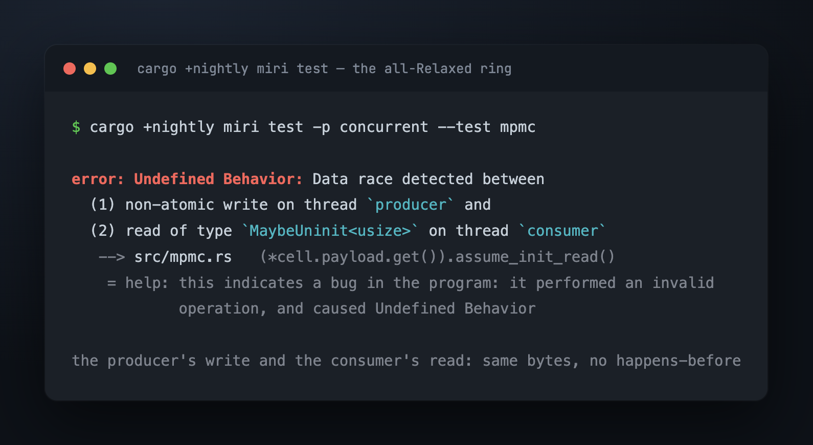
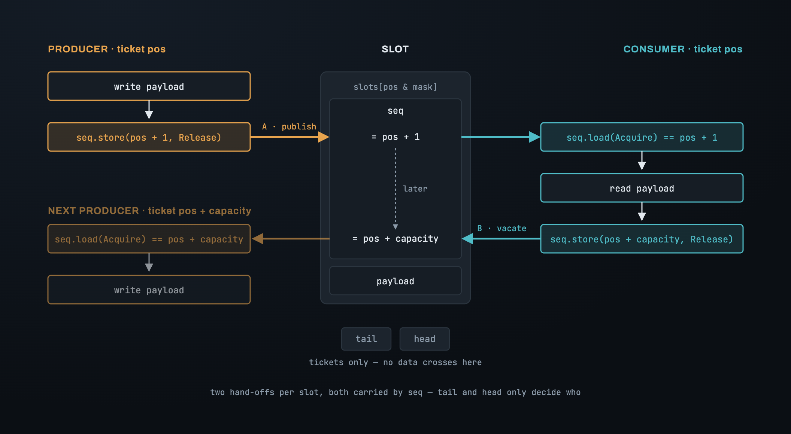
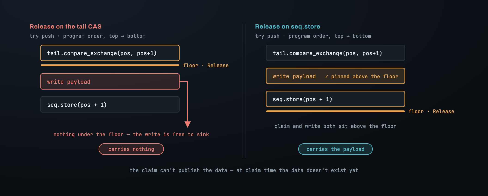
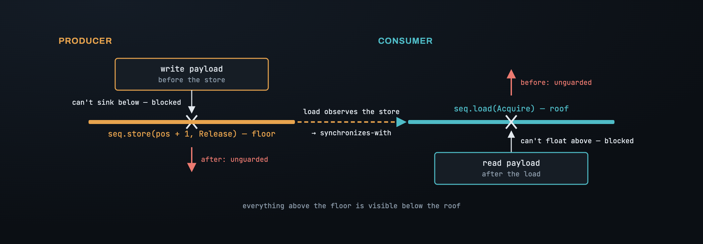
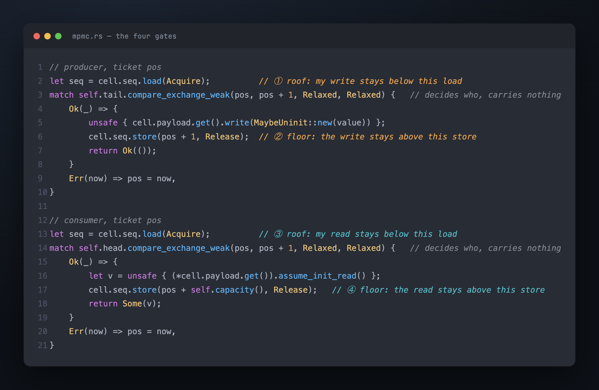
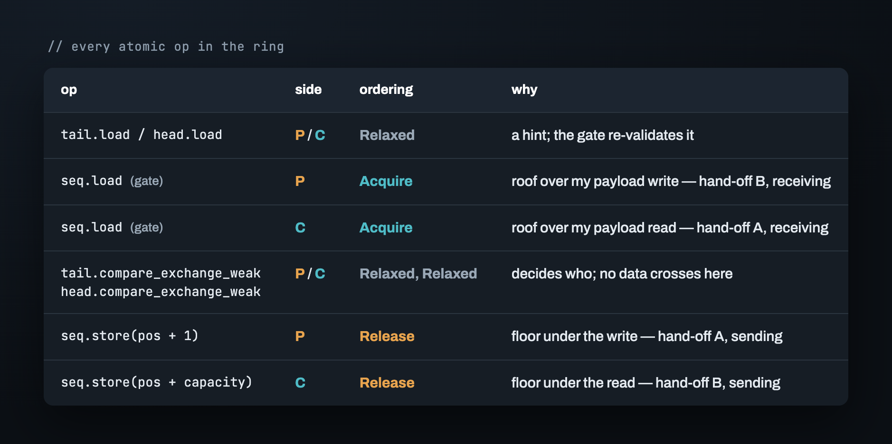
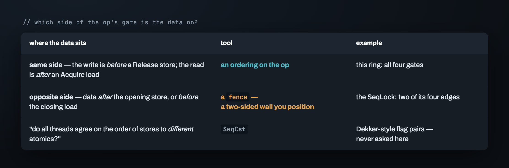

# Part 3 — Getting the memory ordering right

At the end of Part 2 the ring was logically correct, and every atomic operation in it
was `Relaxed` — atomic, but promising nothing about order. Run the tests under Miri
and this comes back:

The two accesses it names are the payload write in `try_push` and the payload read in
`try_pop`. Different threads, same bytes, and nothing that orders one before the
other. On the M2 the symptom is a consumer that occasionally reads the slot's previous
contents; in Rust's memory model it's undefined behavior before it's a wrong value.
The logic says the consumer only reads after the producer published. The hardware
never heard the logic.

This part places every ordering by argument, not by trial. The argument has three
steps: find where data crosses threads, decide which atomic carries each crossing,
then put `Release` and `Acquire` on the side of that atomic that actually covers the
data.

## Where the data crosses

A plain (non-atomic) write on one thread and a plain read of the same bytes on another
need a *happens-before* between them, and there is exactly one way to build one across
threads: a `Release` store on the writer's side, an `Acquire` load of **the same
atomic** on the reader's side, and the load observing that store. Everything before
the `Release` then happens-before everything after the `Acquire`.

So the job is to list every place the ring has such a pair. Per slot there are two:

- **A — publish.** The producer writes the payload; the consumer reads it.
- **B — vacate.** The consumer reads the payload; the *next lap's* producer overwrites
  it. Writing over bytes another thread may still be reading is a race too.

Each of those is a *hand-off*: one thread finishes with the bytes and signals, the
other picks them up — a sending side and a receiving side. Two hand-offs, so two
`Release`/`Acquire` pairs. The question is which atomic each pair rides on — and the
ring has three candidates: `tail`, `head`, and the slot's `seq`.

## Why the payload rides on `seq`, not on the counter

The instinct is the counter. The consumer only reads after it sees the producer's
ticket was claimed, so publish through the claim: make the `compare_exchange` on `tail`
a `Release`. It can't work, and the reason is program order.

`Release` is a **floor under what comes before it**. In `try_push`, the CAS on `tail`
runs *before* the payload write — that was the whole problem in Part 2. A `Release` on
that CAS has nothing under it. The write is still above the floor, free to sink past.

The `seq` store runs *after* the write. A `Release` there has the write beneath it.
That's the only store in the producer that can carry the payload, and it's the same
one the consumer's gate already waits on.

> **The claim can't publish the data, because at claim time the data doesn't exist
> yet. Publication belongs to the last store after the write — `seq`.**

Both hand-offs land on `seq`. Hand-off A is the producer's `seq.store(pos + 1)`, read
by the consumer's gate. Hand-off B is the consumer's `seq.store(pos + capacity)`, read
by the next producer's gate. The counters carry nothing but tickets.

## Floor and roof

The two orderings are one-sided, and it's worth being exact about which side.

`Release` on a store is a floor under everything before it in program order: nothing
above may sink below the store. It says nothing about what comes after. `Acquire` on a
load is a roof over everything after it: nothing below may rise above the load. It says
nothing about what comes before. When the `Acquire` load reads the value the `Release`
store wrote, the two halves lock: what was above the floor is now guaranteed visible
below the roof.

That's the whole tool. Place it by asking, at each atomic op: *which side is the data
on, and does this op's gate cover that side?*

## Placing every ordering

Walk `try_push` top to bottom.

1. `tail.load` — a hint. The gate re-validates it, and a stale value costs one extra
   loop. **`Relaxed`.**
2. `seq.load`, the gate. After it, this thread will *write* the payload. That write must
   not begin before the previous consumer's read of the same bytes has finished —
   hand-off B. The consumer published its read with a `Release` on the vacate store;
   this load needs to be the roof that keeps my write below it. **`Acquire`.**
3. `tail.compare_exchange_weak` — decides *who* owns the ticket, and nothing else. The
   slot was already checked by (2); the payload will be published by (5). No data
   crosses on this op. **`Relaxed`, success and failure.**
4. The payload write. Plain.
5. `seq.store(pos + 1)` — the floor under (4). Hand-off A's sending side. **`Release`.**

`try_pop` is the mirror. `head.load` is a hint, `Relaxed`. The `seq` gate is the roof
over the payload read that follows — hand-off A's receiving side — `Acquire`. The
`head` CAS decides who, `Relaxed`. The read is plain. The vacate store
`seq.store(pos + capacity)` is the floor under that read — hand-off B's sending
side — `Release`.

## The CAS is `Relaxed` on purpose

The one people flinch at is (3). The payload access sits inside the `Ok` branch of the
CAS — surely the thing that decides whether you may touch the slot should also order
the touch?

Atomicity is not ordering. `compare_exchange` guarantees the read-modify-write is
indivisible — no two threads take ticket `pos`. It says nothing about when the payload
becomes visible to anyone, and it doesn't need to: the access is already roofed by the
`Acquire` in (2), which precedes it, and floored by the `Release` in (5), which follows
it. The CAS sits between two gates that do the work. An `AcqRel` on it would buy
nothing and cost a barrier on every claim — on aarch64, a `casal` where a `cas` will
do.

## Why no fence — the difference from a SeqLock

The [SeqLock](../../seqlock/en/03_memory_ordering.md) needed two standalone
`fence`s on top of its orderings. This ring needs none, and the reason is the test
from the floor-and-roof section.

At each of the four gates, ask which side the data is on. The producer's write is
*before* its `Release` store — and *before* is what `Release` covers. The consumer's
read is *after* its `Acquire` load — and *after* is what `Acquire` covers. Four gates,
four same-side answers. An ordering on the op reaches everything it needs to.

In the SeqLock, two of the four edges put the payload on the far side: the writer's
payload stores came *after* the opening bump, and the reader's copy came *before* the
closing check. No ordering on those ops could reach the data. A fence — a two-sided
wall you position yourself, not a gate glued to an op — was the only tool.

There's a third level, `SeqCst`, for when the question isn't "does this thread see that
thread's data" but "do all threads agree on the order of stores to *different*
atomics". The ring never asks it. Each hand-off is one atomic, one direction. Every
ordering above was placed by an argument. So was the all-`Relaxed` version — the
argument being that the tests passed. Part 4 is how you check an argument: two tools,
one of which will tell you the wrong ring is fine.

---

*Next: [Part 4 — Proving it: two tools, and a lying green](04_proving_it.md) · [Index](00_index.md)*
