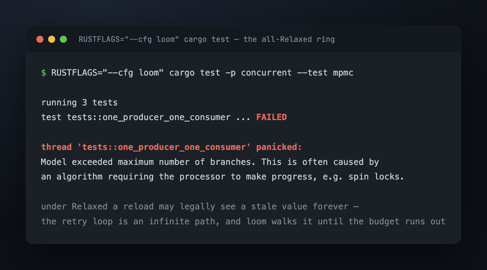
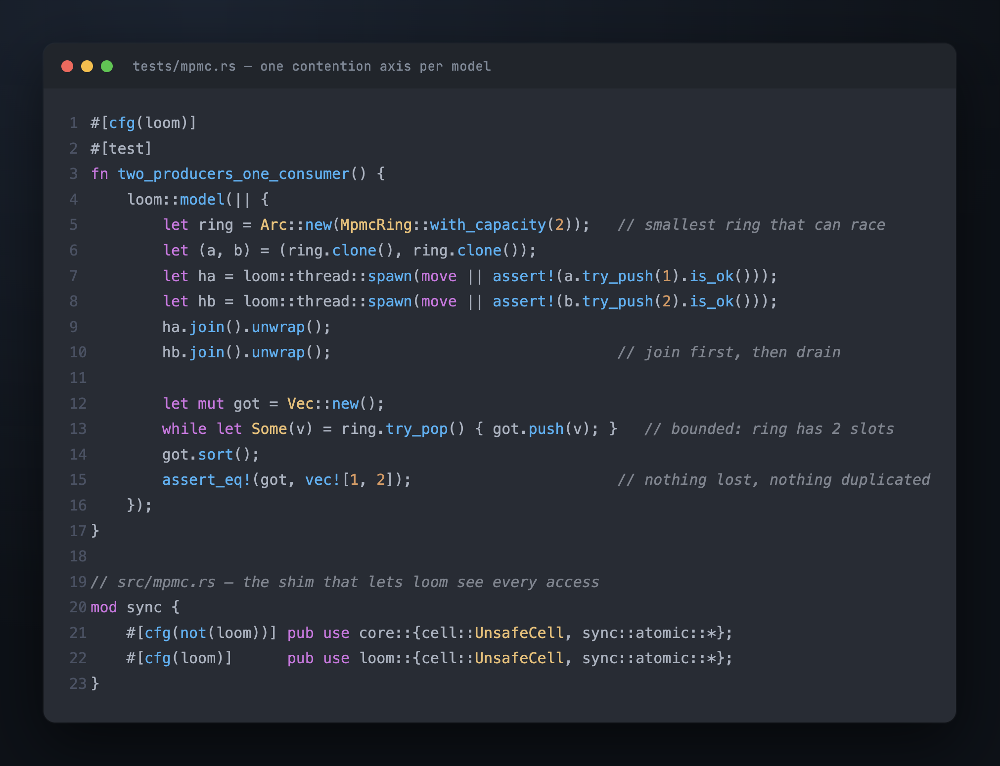
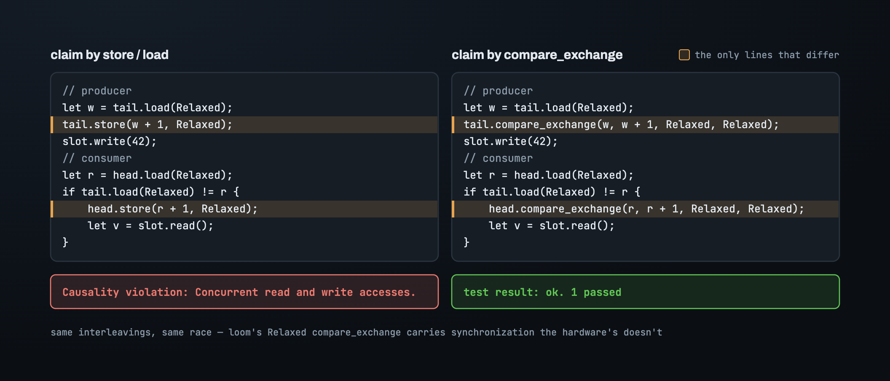
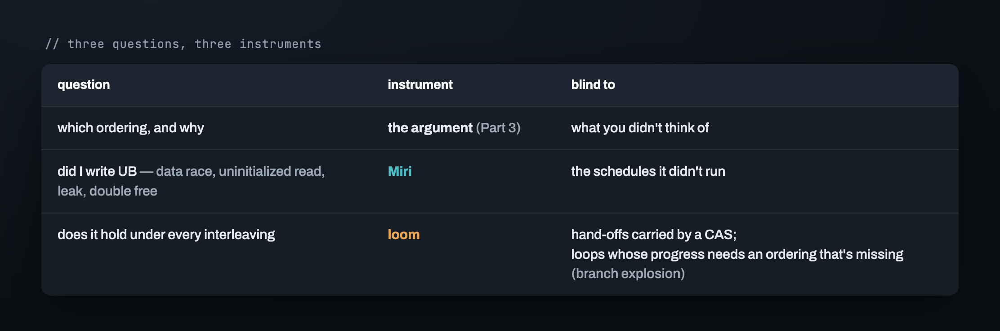
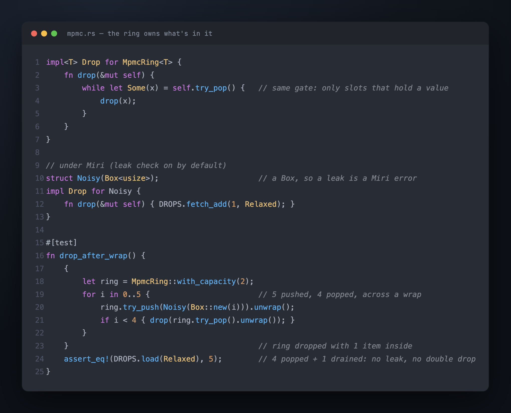
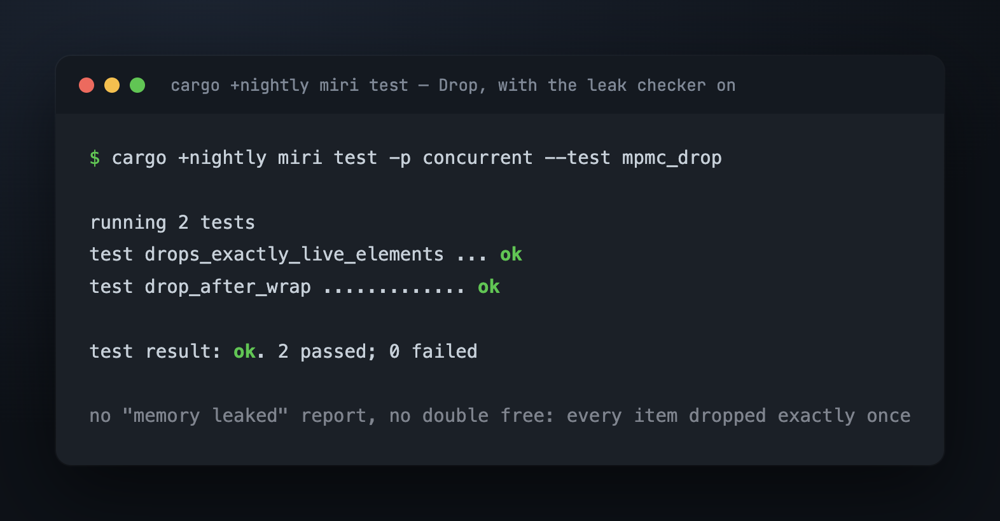
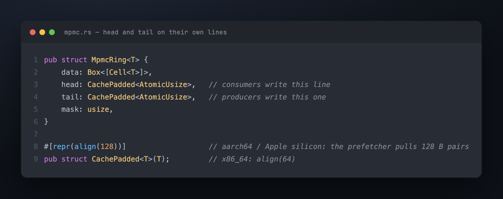
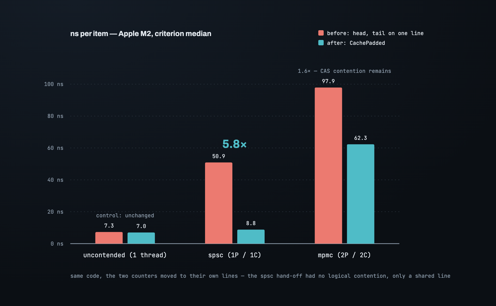

# Part 4 — Proving it: two tools, and a lying green

Part 3 placed every ordering by argument. The all-`Relaxed` ring had an argument too —
the tests passed — so an argument isn't proof. There are three questions left, and
they need three different instruments:

1. *Is `Relaxed` enough here, and if not, which ordering?* — the reasoning in Part 3.
2. *Did I write undefined behavior?* — Miri.
3. *Does it hold under every interleaving?* — loom.

Each is blind to something the others see. The interesting one is loom, because it
will pass a broken ring and say so in green.

## Miri: the race, by name

Miri interprets the compiled program and tracks every byte: who wrote it, on which
thread, with what ordering, and whether the read that follows has a happens-before to
the write. On the all-`Relaxed` ring it stops at the first payload read that doesn't —
the card at the top of Part 3. Data race, the two threads, the type at the address:
`MaybeUninit<usize>`. That precision is why Miri comes first. It also catches the
other things a queue can do wrong with memory — an uninitialized read, a leak, a
double free — and it's fine with spin loops.

What Miri does not do is enumerate. It runs the interleavings it happens to run, with
some preemption thrown in. A race that needs a specific schedule can slip past.

## loom: an explosion instead of an answer

loom runs a small test under *every* interleaving the memory model permits, within a
bound. It also models the orderings: a `Relaxed` load may return a value the store
thread wrote a while ago, and loom will explore the schedule where it does.

On the all-`Relaxed` ring, loom didn't fail. It gave up:

This is a verdict, just an indirect one. The gate loop from Part 2 — `diff > 0`,
reload the counter, retry — assumes the reload eventually sees a fresh value. Under
`Relaxed`, nothing says it must; a stale value is legal forever, so the path where
the loop never terminates is a real path, and loom follows it until its branch budget
runs out. Put the Part 3 orderings in and the stale-forever schedules stop being
legal. The model becomes finite, and green. loom is telling you, in its own way, that
your loop's *progress* was resting on an ordering you hadn't written.

The test has to cooperate. One contention axis per model — two producers and a
consumer, or two consumers and a producer, never everything at once — a capacity of
two, producers joined before the consumer drains, and any retry in the test body
bounded. Payload access goes through `loom::cell::UnsafeCell` so loom can see it,
behind a `cfg(loom)` shim that swaps in `loom`'s atomics.

## The lying green

Three loom models, three greens. Time to stop trusting and start probing: give loom
the *naive* ring from Part 2, the one that claims on `tail` and writes afterward, and
which we know reads a slot before it's written.

Green.

Now the probe. A minimal hand-off, everything `Relaxed`: the producer claims a counter
and then writes the slot; the consumer sees the counter move, claims its side, and
reads the slot. Written with `store`/`load`, loom says exactly what it should:
*Causality violation: concurrent read and write accesses.* Change the two claims to
`compare_exchange` — same interleavings, same race — and loom passes.

loom's model of a `Relaxed` `compare_exchange` is stronger than the hardware's. A
hand-off whose receiving side runs through a CAS gets synchronization from loom that
an M2 will not give it. So:

> **loom cannot see a race carried by a compare-and-swap. Its green is evidence only
> for hand-offs that go through a plain store and load.**

Which is one more reason the Part 3 design routes every hand-off through `seq` — a
store and a load — and keeps the CAS for what it can do, which is decide who. Had we
published through the counter's CAS, loom would have blessed it. Miri would not have.

## Division of labor

The reasoning decides which ordering and why, and is blind to what you didn't think
of. Miri finds the UB you actually wrote, and is blind to the schedule it didn't run.
loom runs every schedule, and is blind to CAS-carried hand-offs, and can't terminate
a loop whose progress depends on a missing ordering. Any one of them alone would have
let a wrong ring through. The three of them didn't.

## Drop: the ring owns what's in it

One more thing Miri watches for. `Box<[Cell<T>]>` drops the cells, but a cell holds
`MaybeUninit<T>`, which drops nothing — it can't know whether it holds a value. Items
still in the ring when it's dropped leak.

The fix is the same gate again: `impl Drop` drains with `try_pop` and drops each
item. It works after any number of laps because `try_pop` already knows which slots
hold a value. Under Miri, whose leak checker is on by default: a payload with a `Box`
inside and a drop counter, three pushed, one popped, ring dropped — exactly three
drops. Five pushed and four popped across a wrap of a two-slot ring — exactly five.

## The last nanoseconds: false sharing

The ring is correct. Now the number. `criterion` on the M2, one item pushed and popped
per iteration:

- one thread, push then pop — **~7.3 ns**.
- one producer thread, one consumer thread — **~51 ns**.

Seven times the single-thread cost, for a hand-off that Part 1 established has *no*
logical contention: one writer per slot, one reader per slot, and the two counters
touched by different threads.

Touched by different threads, and sitting next to each other. `head` and `tail` are
two adjacent `AtomicUsize`s — sixteen bytes, one cache line. The producer writes
`tail`, which invalidates the consumer core's copy of the line. The consumer writes
`head`, which invalidates the producer's. Neither thread ever reads the other's
counter on the hot path, and they pay for each other's writes anyway. That's false
sharing, and the fix is to put each counter on its own line: `CachePadded`, 128 bytes
on Apple silicon, where the prefetcher pulls lines in pairs.

The single-producer/single-consumer hand-off goes from ~51 ns to ~8.8 ns — 5.8×, and
now within two nanoseconds of the single-thread floor. Two producers and two consumers
go from ~98 to ~62; what's left there is real contention on the counters' CAS, which
no padding removes. The control, one thread doing both, moves from 7.3 to 7.0 — noise —
which is what tells you the win is the padding and not the run.

Padding each slot's `seq` as well is the obvious next step and isn't worth it: it
quadruples the memory of a ring of small payloads to chase the last 1.8 ns.

That's the ring. Two counters that allocate turns, a sequence per slot that hands the
baton around with a ticket number on it, four orderings placed by where the data sits,
three instruments that each catch what the others miss, and two cache lines where one
was costing 40 nanoseconds.

---

*[Back to the index](00_index.md)*
