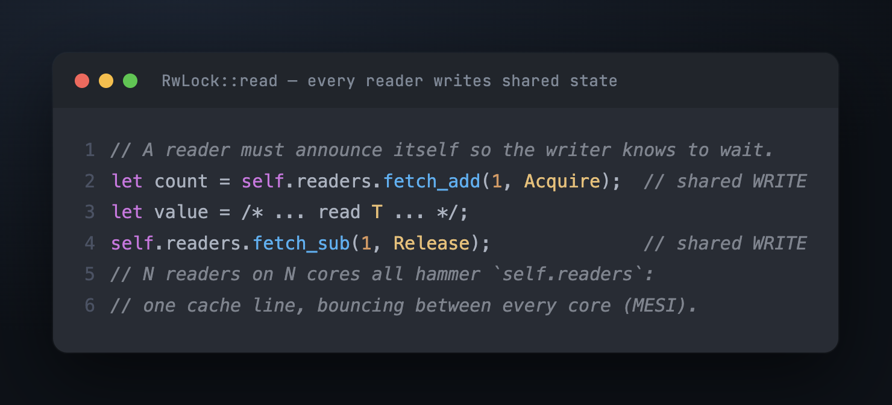
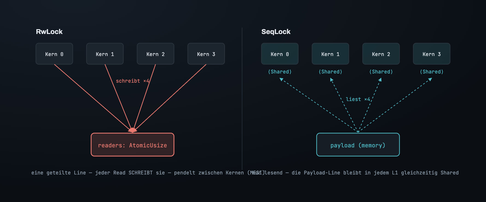

# Teil 1 — Das Problem, und warum die naheliegenden Locks nicht passen

Ein Blockchain-Node rückt seinen kanonischen Chain-Head etwa alle zwölf Sekunden
vor. In den zwölf Sekunden dazwischen muss alles andere im Node wissen, was der
Head *ist*: jedes `eth_blockNumber`, jedes mit `latest` markierte `eth_call`, jede
Transaktion, die der Mempool validiert, jede Antwort an einen Peer. Zehntausende
Reads pro Sekunde, aus Dutzenden Threads, gegen einen einzigen Write alle zwölf
Sekunden. Oder nimm eine Exchange: Ein Oracle-Thread aktualisiert
`(mark_price, funding_index, timestamp)` einmal pro Tick, und die Risk-Engine liest
es bei *jeder einzelnen Order*, um Margin zu berechnen. Ein langsamer Read dort ist
ein langsamer Tail für den ganzen Handelsplatz.

Das ist die Form, für die ein SeqLock gebaut ist: **ein Wert, selten geschrieben,
ständig von überall gelesen.** Es klingt, als müsste das leicht sein. Ist es nicht,
aus zwei Gründen, die nichts damit zu tun haben, wie oft man liest.

## Der Wert passt nicht in ein Register

Ein Chain-Head ist `(B256, u64)` — ein 32-Byte-Hash und eine 8-Byte-Zahl, 40 Byte.
Es gibt keine CPU-Instruktion, die 40 Byte unteilbar schreibt. Der größte atomare
Store, den die Hardware bietet, ist ein Maschinenwort — 8 Byte auf einer
64-Bit-Maschine, 16 mit einem double-width compare-and-swap, wenn man vorsichtig
ist. Vierzig Byte sind außer Reichweite.

Das heißt, es gibt *immer* ein Fenster — wie kurz auch immer —, in dem der Speicher
einen Wert hält, der halb der alte Head und halb der neue ist. Ein Reader, der in
diesem Fenster landet, bekommt keinen veralteten Wert. Er bekommt den Hash von
Block 1000, gepaart mit der Zahl 999: einen Wert, den es **nie gegeben hat**. Gibt
man den an einen Nutzer weiter, ist er falsch; füttert man ihn in einen
State-Root-Lookup, wird der Node korrumpiert. Veraltet wäre überlebbar — „ein paar
Millisekunden hinterher" ist in Ordnung. Das hier ist schlimmer als veraltet. Das
hier ist erfunden.

Diese Grenze gehört der Hardware, nicht der Sprache. Schreib es in C, und es ist
exakt dasselbe.

## Atomic pro Feld rettet dich nicht

Hier der Reflex-Fix: Mach jedes Feld zu seinem eigenen Atomic. `mark_price` ist ein
`u64`, pack es in ein `AtomicU64`; `funding_index` auch. Jetzt liest sich jedes
Feld atomar — kein Feld wird je zerrissen. Problem gelöst?

Nein — denn das Problem war nie ein einzelnes Feld. Die Risk-Engine liest
`mark_price` aus Tick N und, ein paar Nanosekunden später, `funding_index` aus Tick
N+1, weil der Writer dazwischen beide aktualisiert hat. Jeder Read war für sich
atomar und korrekt. Das *Paar* ist ein Wert, den es nie gegeben hat, und die daraus
berechnete Margin ist falsch — falsch genug, um einen Account zu liquidieren, der
eigentlich gesund war. Das ist echtes Geld, verloren an einen Konsistenz-Bug, den
Atomics pro Feld strukturell nicht fangen können.

Das eigentliche Problem ist also nicht „40 Byte sicher lesen". Es ist:

> **Veröffentliche einen Snapshot aus mehreren Feldern so, dass jeder Reader stets
> einen Snapshot sieht, den es als Ganzes tatsächlich gegeben hat.**

## Drei Constraints, nicht eines

Wäre Korrektheit die einzige Anforderung, wäre dies ein gelöstes und langweiliges
Problem — ein Lock drumherum, und Feierabend. Interessant wird es, weil Korrektheit
in drei Constraints verpackt kommt, mit denen der Lock zu kämpfen hat:

- **Reader dürfen den Writer nicht bremsen.** Der Engine-Thread, der den Chain-Head
  vorrückt, ist der kritische Pfad des Nodes; der Oracle-Thread, der den Mark-Price
  aktualisiert, ebenso. Kann ein Reader den Writer warten lassen, haben wir einen
  unwichtigen Thread den wichtigsten blockieren lassen.
- **Reader dürfen sich nicht gegenseitig bremsen.** Da lesen zweiunddreißig Threads
  auf zweiunddreißig Cores. Sie haben keinen logischen Konflikt — Lesen ist teilbar
  —, also ist jeder Aufwand, der *nur deshalb entsteht, weil es andere Reader gibt*,
  reine Verschwendung.
- **Der Read-Pfad muss beschränkt und allokationsfrei sein.** Auf der Exchange lebt
  er in einem Latenzbudget pro Order, gemessen in Mikrosekunden. Er kann nicht für
  eine Heap-Allocation pausieren, und er kann nicht ohne Obergrenze erneut
  versuchen.

Halte diese drei gegen jeden Kandidaten weiter unten; jeder erfüllt die Korrektheit
und bricht eines davon.

## Die Asymmetrie, die die Mutex-Sichtweise übersieht

Hier ist die Beobachtung, um die sich das ganze Design dreht, und sie ist der
Grund, warum dies *nicht* das klassische Mutual-Exclusion-Problem ist.

Ein Mutex existiert, um zu lösen: „Viele Parteien **modifizieren** alle, also
müssen sie sich abwechseln." Hier aber modifiziert nur eine Partei. Der einzige
echte Konflikt besteht zwischen dem Writer und einem Reader, und er ist auf drei
Weisen asymmetrisch:

1. **Reads übertreffen Writes um Größenordnungen.** Den Write-Pfad zu optimieren
   heißt, das Falsche zu optimieren.
2. **Der Reader braucht den Wert nicht stillgehalten.** Er modifiziert nichts, also
   braucht er kein „Fasst das nicht an, während ich arbeite." Er braucht einen
   gültigen Snapshot, dann zieht er los und rechnet auf diesem Snapshot; dass sich
   der Wert einen Augenblick später ändert, ist in Ordnung. Weil er read-only ist,
   braucht er *einen* Snapshot, den es einmal gegeben hat — nicht den *neuesten* und
   keinen *eingefrorenen*.
3. **Der Reader kann seine Arbeit wiederholen.** Kommt ein Read verstümmelt heraus,
   kostet nochmaliges Lesen nichts — es gibt keinen Seiteneffekt zurückzurollen.

Ein Mutex bezahlt für eine stärkere Garantie, als wir brauchen: Er gewährt
*exklusiven Besitz*, um den der Reader hier nie gebeten hat. Und der Reader bezahlt
diese Garantie in der einen Währung, die wir uns nicht leisten können — er muss in
gemeinsamen Speicher schreiben, um den Lock zu nehmen.

## Warum also kein `RwLock`? Er lässt Reader doch schon gemeinsam rein

Der naheliegende Einwand: Ein Read-Write-Lock *ist* für viele Reader gebaut.
Mehrere Reader halten die Read-Seite gleichzeitig. Ist die Sache damit nicht
erledigt?

Nein — denn „lässt sie gemeinsam rein" ist ein Versprechen, das das *Interface*
gibt und das die *Implementierung* nicht umsonst halten kann. Um Reader gemeinsam
reinzulassen, muss der Lock wissen, wie viele Reader gerade drin sind, damit er
erkennt, wann es sicher ist, einen Writer zuzulassen. Das zu wissen heißt: Jeder
Reader erhöht beim Eintreten einen gemeinsamen Zähler und verringert ihn beim
Verlassen:

Logisch stehen diese Reader nicht im Konflikt. Physisch schon. Dieser Zähler lebt
auf einer cache line, und eine cache line, die ein Core schreibt, muss in jedem
anderen Core, der sie hält, invalidiert werden — das MESI-Protokoll. Also
verbringen zweiunddreißig Reader auf zweiunddreißig Cores, ganz ohne jeden
logischen Konflikt, ihre Zeit damit, eine Line zwischen sich hin- und
herzuschieben:

Lesen soll teilbar sein, und hier ist es *alles andere als das* — die Reader
serialisieren sich auf Metadaten, die der Lock nur braucht, um zu existieren.
Schlimmer noch, der Reader blockiert weiterhin den Writer: Solange irgendein Reader
die Read-Seite hält, wartet der Writer, was ebenfalls das erste Constraint
verletzt. `RwLock` ist logisch richtig und physisch exklusiv.

## Und warum nicht einen Pointer tauschen? (`ArcSwap`, RCU)

Es gibt eine cleverere Familie, die das Tearing komplett umgeht. Überschreib nicht
an Ort und Stelle — bau den neuen Wert woanders und kipp dann einen einzelnen
Pointer darauf um. Ein Pointer ist 8 Byte, also *ist* das Umkippen atomar; ein
Reader sieht entweder den ganzen alten oder den ganzen neuen Wert, nie eine
Mischung. Genau das tun `ArcSwap` und RCU, und für große oder pointer-reiche Werte
ist es das richtige Werkzeug.

Aber es verschiebt den schweren Teil, statt ihn zu beseitigen. Sobald der Writer
den Pointer umgekippt hat, lesen manche Reader vielleicht noch den alten Wert. Wann
ist es sicher, freizugeben? Der Writer muss wissen, ob irgendein Reader noch den
alten Pointer hält — was heißt, der Reader muss erneut *seine Anwesenheit
ankündigen* (ein Reference Count, eine Epoche, ein Hazard Pointer). Wir sind zurück
bei Readern, die gemeinsamen Zustand schreiben, plus einer Allocation bei jedem
Write und einem Reclamation-Problem, das zu verwalten ist. Korrekt und oft die
Sache wert — aber es bricht dieselben Constraints, aus demselben zugrunde liegenden
Grund.

## Was jeder Fehlschlag gemeinsam hat

Stell die Kandidaten in eine Reihe:

| | Reader muss… | bricht |
|---|---|---|
| `Mutex` | einen exklusiven Lock nehmen | Reader serialisieren sich gegenseitig |
| `RwLock` | einen gemeinsamen Reader-Zähler schreiben | Reader schieben eine cache line hin und her; blockieren weiterhin den Writer |
| `ArcSwap` / RCU | sich zur Reclamation ankündigen | gemeinsamer Write + Allocation pro Write |
| Atomics pro Feld | (nichts) | keine feldübergreifende Konsistenz — das erfundene Paar |

Jede Zeile, die korrekt ist, zwingt den Reader, in gemeinsamen Speicher zu
schreiben oder den Writer warten zu lassen. Die eine Zeile, die keines von beidem
tut, ist nicht korrekt. Die Constraints deuten auf einen einzigen Schluss:

> **Der Reader muss unsichtbar sein** — er darf keinen gemeinsamen Speicher
> schreiben, und der Writer muss laufen, als gäbe es überhaupt keinen Reader.

Das klingt unmöglich: Wenn der Writer sich nie mit Readern koordiniert, was hält
einen Reader davon ab, einen halb geschriebenen Wert zu lesen? Nichts. Der Kniff
also — die ganze Idee eines SeqLock — ist, gar nicht erst zu *versuchen*, es zu
verhindern, und stattdessen den Reader das Chaos lesen zu lassen und es dann
*bemerken* zu lassen. Das ist Teil 2.

---

*Weiter: [Teil 2 — Die Wette: lass es zerreißen und fang es ab](02_the_bet.md) · [Index](00_index.md)*

*English: [`../en/01_the_problem.md`](../en/01_the_problem.md)*
