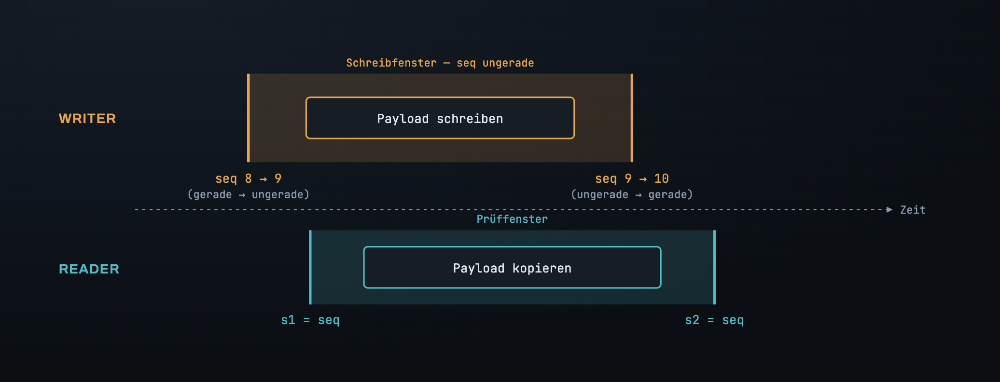
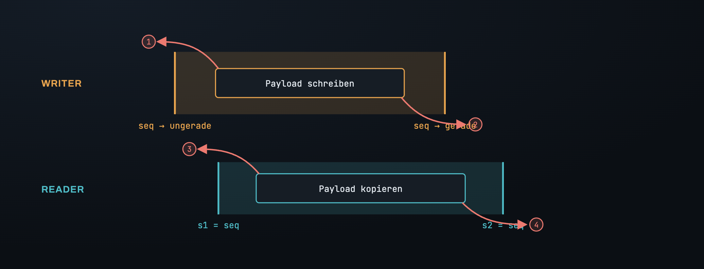
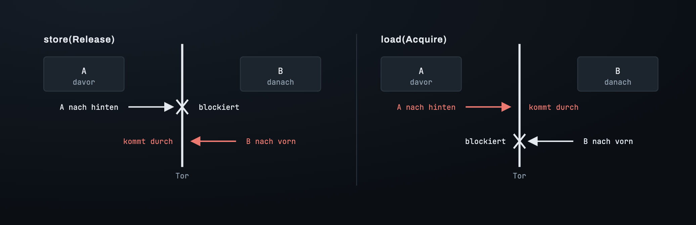
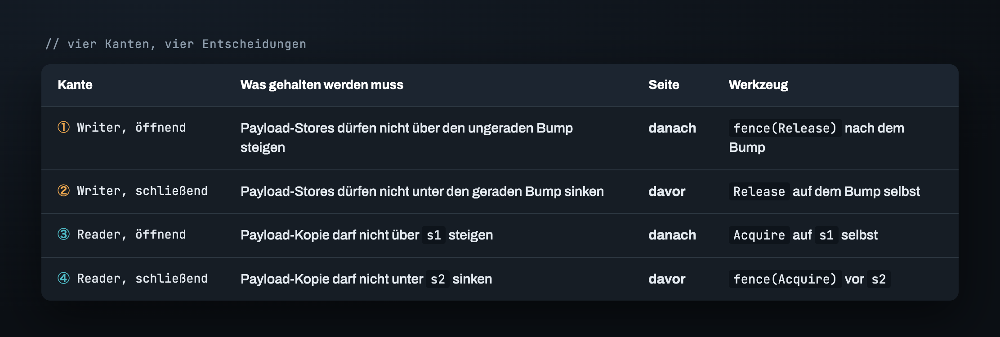
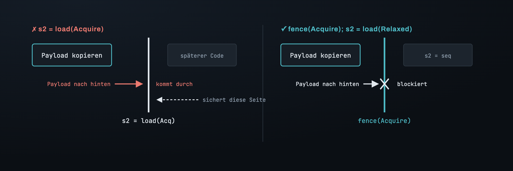
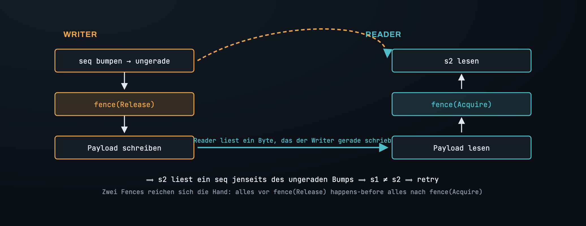

# Teil 3 — Das Memory Ordering richtig hinbekommen

Am Ende von Teil 2 hatten wir ein Protokoll, und es war korrekt. Der Writer erhöht
einen Sequenzzähler auf ungerade, schreibt den payload, erhöht ihn zurück auf gerade.
Der Reader liest den Zähler, kopiert den payload, liest den Zähler erneut und traut
der Kopie nur, wenn beide Reads übereinstimmten und gerade waren. Auf dem Papier
wasserdicht.

Hier ist es, alle Orderings `Relaxed` — atomar, aber ohne jedes Versprechen über die
*Reihenfolge*:

Lass es auf einem Apple M2 unter echter Contention laufen, und es zerreißt — ein Reader
bekommt `[54458, 54458, 54459, 54459]`, halb die eine Version und halb die nächste.
Nicht jedes Mal. Vier von fünf Läufen kommen grün zurück. Genau dieses Verhältnis —
meistens grün, gelegentlich falsch — ist der Fingerabdruck eines Memory-Ordering-Bugs,
und deshalb kannst du einem bestandenen Test hier nicht trauen. (Auf x86 würde er jedes
Mal bestehen, in Produktion gehen und dann auf deinem ARM-Server versagen. Das ist der
Bug, für den „läuft doch auf meiner Maschine" erfunden wurde.)

## Das Fenster ist real; der payload steckt nicht darin

Das Protokoll baut ein Fenster. Die zwei Bumps des Writers sind seine Kanten; der
payload soll zwischen ihnen leben. Die zwei Zähler-Reads des Readers bauen ein passendes
Fenster; die Kopie soll zwischen *diesen* leben.

Aber nichts im bisherigen Code *zwingt* den payload, drinnen zu bleiben. `Relaxed`
bedeutet genau das, was es sagt: Die Operation ist atomar, und ihre Reihenfolge relativ
zu allem drumherum ist unbeschränkt. Der Compiler darf umordnen; die CPU — auf einem
schwachen Memory-Model wie aarch64 — darf zur Laufzeit umordnen, solange die eigene
Sicht *dieses einen Threads* konsistent bleibt. Ein anderer Thread sieht das
Durcheinander.

Der payload kann das Fenster also über jede von vier Kanten verlassen:

① Der payload-Store des Writers steigt *über* den Bump auf ungerade auf, sodass ein
Reader einen geraden Zähler sieht, während die Daten schon halb geändert sind. ② Er
sinkt *unter* den Bump auf gerade, sodass der Zähler „stabil" meldet, bevor der
Schreibvorgang fertig ist. ③ Die Kopie des Readers steigt über `s1` auf, oder ④ sinkt
unter `s2` — validiert und dann neu gelesen. Jede Kante ist ein eigenes Leck, und jede
braucht eine eigene Entscheidung.

## Die Idee, die alle falsch herum verstehen: einseitige Gates

Um den payload festzunageln, greifen wir zu `Release` und `Acquire`. Der universelle
Fehler ist, sie sich als Wände vorzustellen, die beide Richtungen blockieren. Tun sie
nicht. **Jedes ist ein einseitiges Gate, und es bewacht nur eine Seite der Operation, an
der es hängt.**

`Release` auf einem Store ist ein *Boden unter allem, was davor kommt*: Nichts darüber
kann hindurchsinken. Über das, was danach kommt, sagt es nichts. `Acquire` auf einem
Load ist ein *Dach über allem, was danach kommt*: Nichts darunter kann hindurchsteigen.
Über das, was davor kommt, sagt es nichts. Der rote Pfeil in jedem Panel ist die
Richtung, die *nicht* bewacht wird — und genau diese unbewachte Richtung ist die, die
alle vergessen.

Sieh zu, wie es gleich den allerersten Fix falsch macht. Der Instinkt sagt: Der Bump auf
ungerade öffnet das Fenster, also mach ihn zu einem `Release`.

Was wir festhalten müssen, ist der payload, und der payload kommt *nach* dem Bump.
`Release` bewacht die *Vorher*-Seite. Wir haben gerade eine Tür verriegelt, durch die
niemand geht, und Fluchtweg ① steht immer noch sperrangelweit offen. Das Wort ist
richtig; die Seite ist falsch.

## Vier Kanten, vier Entscheidungen

Stell an jeder Kante eine Frage: *Liegt das, was ich festhalten muss, auf der Seite, die
das Gate dieser Operation ohnehin abdeckt, oder auf der Gegenseite?* Gleiche Seite — ein
Ordering auf dem Atomic selbst genügt. Gegenseite — du brauchst eine eigenständige
`fence`, genau an der Grenze platziert.

Beachte die Symmetrie: Die zwei Kanten, die ein Fenster *öffnen*, müssen halten, was
danach kommt; die zwei, die es *schließen*, müssen halten, was davor kommt. Und genau
zwei der vier — ① und ④ — landen auf der Seite, die das eigene Gate der Operation nicht
erreicht, also können sie überhaupt kein Ordering-auf-der-Operation verwenden. Sie
brauchen eine fence.

## Warum eine fence und nicht einfach ein stärkeres Ordering

Nimm Kante ④, den klarsten Fall. Wir brauchen, dass die payload-Kopie — die *vor* `s2`
sitzt — nicht unter `s2` sinkt. Der verlockende Fix ist, `s2` zu einem `Acquire`-Load zu
machen. Aber ein `Acquire` überdacht, was *nach* `s2` kommt; die Kopie liegt *davor*,
ungedeckt. Die Kopie sinkt glatt hindurch.

Eine `fence(Acquire)`, *zwischen* die Kopie und `s2` gesetzt, ist eine frei stehende
Barriere, die die Kopie nicht überqueren kann. Jetzt ist sie über der fence festgenagelt,
mithin über `s2`. Gleiches Wort, umgekehrte Wirkung — denn eine fence ist eine Wand, die
du positionierst, während ein Ordering-auf-einer-Operation ein einseitiges Gate ist, das
an diese Operation geklebt ist. (Es gibt noch etwas, das ein Ordering nicht kann und das
Ordering eines Loads *besonders* nicht kann: `load(Release)` ist nicht einmal eine legale
Operation — es panickt. `Release` ist das Verb des Publizierens, und das gehört zu
Writes; ein Load hat nichts zu publizieren. Also bleibt `s2` `Relaxed`, und die fence
erledigt die Arbeit.)

Hier ist das Ganze, korrekt, jedes Gate an seinem Platz:

Die zwei `Relaxed`, die im Code übrig sind, sind keine Faulheit — sie sind die Kanten,
an denen ein Ordering eine Seite bewachen würde, auf der nichts liegt, also erledigt
stattdessen die fence daneben die Arbeit.

Diese ganze Aufteilung — wann das Ordering auf dem Atomic genügt und wann man zu einer
fence greifen muss — läuft auf eine einzige Unterscheidung hinaus, die es wert ist,
sich zu merken:

## Was die fences wirklich einbringen: ein Handshake

Alles bisher ist das operative Bild — genug, um den Code korrekt zu platzieren. Aber der
*Grund*, warum er korrekt ist, und der Grund, warum eine fence das richtige Werkzeug ist,
reicht tiefer als „verhindert Umordnung". Zwei fences auf zwei Threads **geben sich die
Hand** und bauen eine happens-before-Beziehung, und diese Beziehung ist die eigentliche
Garantie.

Die zu beweisende Behauptung ist eine einzige:

> Greift die Kopie des Readers auch nur **ein einziges Byte** von Write N auf, dann
> **muss** der `s2`-Read des Readers einen seq-Wert zurückliefern, der über den
> öffnenden (ungeraden) Bump von Write N hinaus fortgeschritten ist — also `s2 ≠ s1`.

Für sich ordnet jede fence nur ihren eigenen Thread. Aber wenn der Reader ein Byte liest,
das der Writer *nach* seiner `fence(Release)` gespeichert hat, und der Reader nach dem
Read eine `fence(Acquire)` ausführt, rasten die beiden fences ineinander: Alles vor der
fence des Writers happens-before alles nach der fence des Readers. Der Bump auf ungerade
liegt auf der ersten Seite; `s2` auf der zweiten. Also wird ein torn read *garantiert*
gefangen — `s1 != s2`, retry.

(„Über den ungeraden Bump hinaus" heißt nicht, dass `s2` den ungeraden Wert selbst liest —
es heißt, dass `s2` ein seq liest, das diesen Schritt bereits *einschließt*. War der Wert
vor Write N stabil bei 100, so macht ihn der ungerade Bump zu 101, der gerade Bump zu 102.
Griff der Reader sein Byte, während der Write noch lief, liest `s2` 101; war der Write schon
fertig, liest `s2` 102. In beiden Fällen ist es jenseits von 100, also `s2 ≠ s1`. Wir setzen
am *ungeraden* Bump an, nicht am geraden, weil der ungerade Bump der früheste Marker ist, der
garantiert jedem payload-Byte vorausgeht — wenn der Reader ein Byte greift, ist der gerade
Bump vielleicht noch nicht passiert, der ungerade aber ganz sicher.)

Das ist auch der Grund, warum ein Ordering-auf-der-Operation nicht genügen würde, selbst
dort, wo es typecheckt: Ein Ordering auf einem Atomic verknüpft *dieses Atomic* über
Threads hinweg, aber hier ist der Datenkanal der **payload**, und das, worüber wir
synchronisieren, ist die **seq** — zwei verschiedene Variablen. Nur eine fence schlägt
die Brücke von der einen zur anderen.

Das Protokoll aus Teil 3 ist jetzt nicht nur auf dem Papier korrekt, sondern auf der
Hardware. Was bleibt, ist ein subtileres Verbrechen, das wir die ganze Zeit begangen
haben: Der Reader hat Bytes gelesen, die der Writer gerade aktiv verändert, und in Rusts
Memory-Model ist das nicht bloß „Müll lesen" — es ist Undefined Behaviour. Das ist Teil 4.

---

*Weiter: [Teil 4 — Lesen ohne UB, und ihm trauen](04_trusting_it.md) · [Index](00_index.md)*

*English: [`../en/03_memory_ordering.md`](../en/03_memory_ordering.md)*
