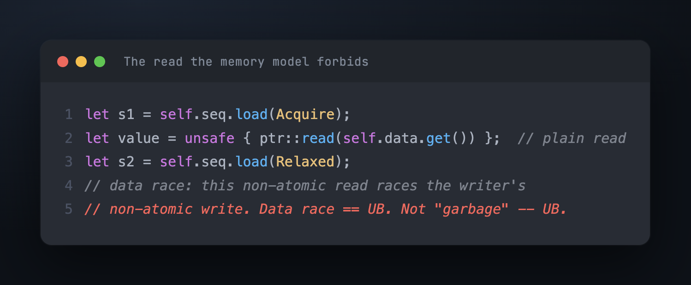
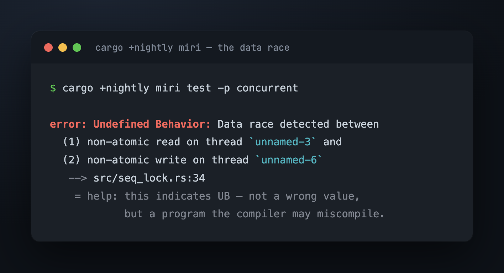
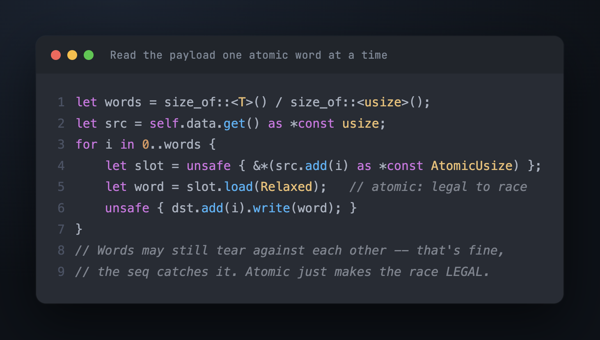
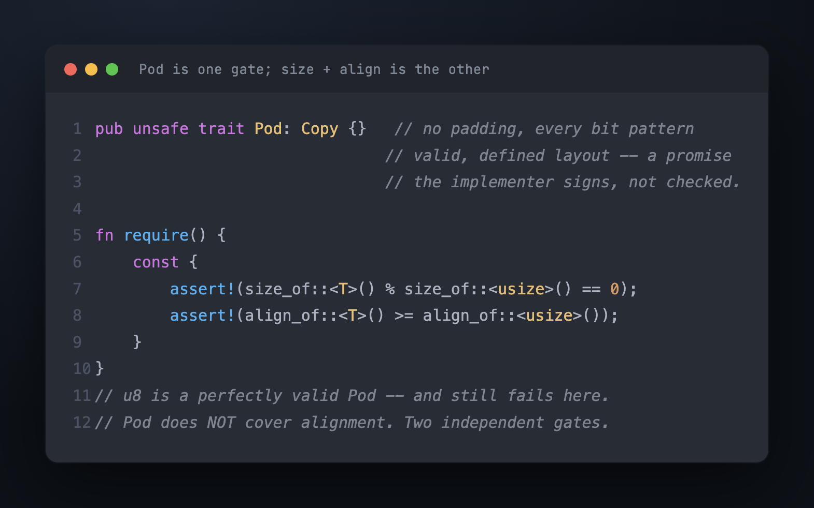
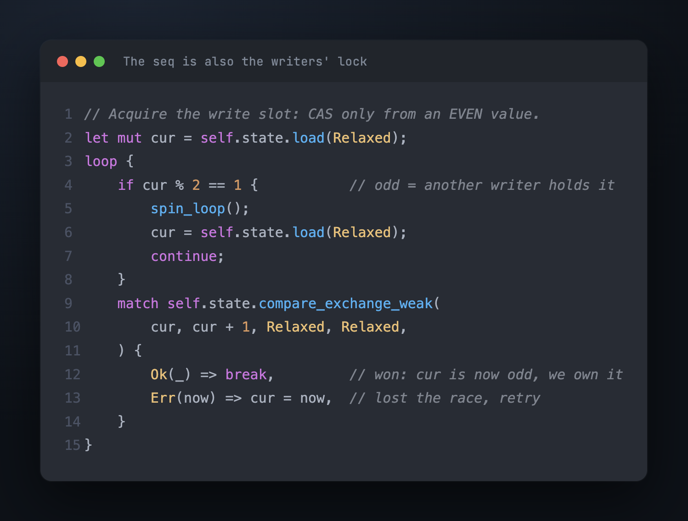
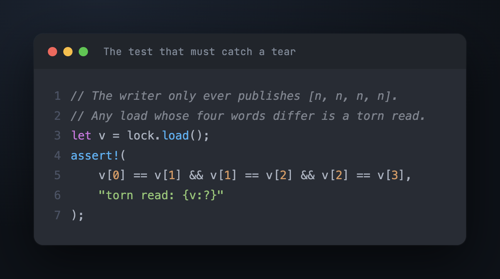

# Teil 4 — Lesen ohne UB, und ihm vertrauen

Teil 3 hat das Protokoll auf der Hardware korrekt gemacht. Aber sieh zurück, was der
Leser die ganze Zeit getan hat, mit Absicht: das Payload zu lesen, während der Schreiber
es gerade aktiv überschreibt. Wir haben das *so entworfen* — die ganze Wette bestand
darin, den Read zerreißen zu lassen und ihn hinterher abzufangen. Der Haken ist, dass
dieser Read in Rusts Speichermodell nicht bloß „Müll liest". Er ist ein Data Race, und
ein Data Race ist Undefined Behaviour.

## Der Read, den die Sprache verbietet

Hier ist der natürliche Weg, das Payload herauszukopieren — ein schlichter Read durch
einen raw pointer:

Zwei Threads berühren dieselben Bytes, einer davon schreibend, kein Zugriff atomar. Das
ist die Lehrbuchdefinition eines Data Race, und in Rust (wie in C++) heißt ein Data Race
nicht „man bekommt einen unspezifizierten Wert". Es ist UB: Der Compiler darf annehmen,
dass es nie passiert, und unter dieser Annahme optimieren — den Read aus der
Retry-Schleife herausziehen, den Wert als unverändert beweisen, Zweige löschen, von
denen er „weiß", dass sie tot sind. Die sorgfältige `s1 == s2`-Prüfung kann von einem
Compiler wegoptimiert werden, der unter der No-Data-Race-Annahme *bewiesen* hat, dass sie
immer wahr ist. Der Fehler ist nicht der Müll; der Fehler ist, dass der Compiler nun aus
einer falschen Prämisse schließt.

Miri — ein Interpreter, der den Code gegen das Speichermodell laufen lässt — sagt es
unumwunden:

## `volatile` ist nicht die Lösung

Wer von C kommt, dessen Reflex ist `volatile`. So liest der seqlock des Linux-Kernels
sein Payload, und dort funktioniert es. Aber `volatile` beantwortet eine andere Frage. Es
weist den *Compiler* an, diesen bestimmten Zugriff nicht wegzulassen, zu duplizieren oder
umzuordnen — es macht den Zugriff **nicht** atomar, und im Speichermodell der Sprache ist
ein `volatile`-Read, der gegen einen Write rennt, immer noch ein Data Race, immer noch
UB. Im Kernel funktioniert es, weil der Kernel von einem bekannten Compiler mit bekannten
Flags übersetzt wird; es ist ein Handel, der mit einer bestimmten Implementierung
geschlossen wird, nicht mit der Sprache. (Hans Boehm hat ein ganzes Paper über genau
dieses Missverhältnis geschrieben: seqlocks und Speichermodelle von Sprachen vertragen
sich nicht, es sei denn, die Sprache gibt einem ein hinreichend billiges Atomic.)

Rust gibt einem eines: einen atomaren `Relaxed`-Zugriff.

## Atomar, Wort für Wort

Die Lösung ist, jeden Zugriff aufs Payload atomar zu machen. Hardware hat kein
40-Byte-Atomic, aber ein 8-Byte-Atomic, also durchlaufen wir den Wert ein `usize`-Wort
nach dem anderen, jedes Wort ein `Relaxed`-Load oder -Store:

`Relaxed` ist der Schlüssel, und es wird weithin missverstanden. Es fügt **keine
Ordnung** hinzu — das war Teil 3s Aufgabe, erledigt von den fences. Was es hinzufügt, ist
Legalität: Ein Atomzugriff, der gegen einen anderen Atomzugriff rennt, ist *kein* Data
Race, also kein UB. Die Wörter können noch immer gegeneinander zerreißen — Wort 0 vom
neuen Wert, Wort 3 vom alten — und das ist in Ordnung, denn der Sequenzzähler fängt genau
das ab. `Relaxed` verhindert das Zerreißen nicht; es macht das Zerreißen *legal*, sodass
der Zähler seine Arbeit tun darf, statt dass der Compiler um ein Rennen herum falsch
kompiliert.

## Die Anforderung, die das erzwingt: `Pod`, und warum es zwei Tore sind

Um ein beliebiges `T` als eine Reihe von `usize`-Wörtern umzudeuten, muss `T`
tatsächlich schlichte Bytes *sein* — kein Padding, jedes Bitmuster gültig (der Leser wird
halb geschriebene Mischungen beobachten, bevor er sie verwirft), ein definiertes Layout.
Das ist der `Pod`-Trait:

Zwei Dinge an dieser Anforderung sind es wert, laut ausgesprochen zu werden. Erstens ist
`Pod` eine *Lizenz, die der Implementierende unterschreibt*, kein Fakt, den der Compiler
nachprüft — `unsafe impl Pod for Foo {}` ist ein Versprechen, das man gibt und für das
man die Verantwortung trägt; macht man es falsch, ist es UB, weshalb der Trait `unsafe`
zu implementieren ist. Es macht Korrektheit nicht automatisch; es *lokalisiert* die
Beweispflicht auf eine greppbare Zeile und lässt versehentlichen Missbrauch (ein
`String`, ein Typ mit Padding) an der Kompilierung scheitern.

Zweitens — und das ist die Falle — ist `Pod` notwendig, aber **nicht hinreichend**. Es
sagt nichts über Größe oder Alignment. `u8` ist ein völlig ehrliches `Pod`, und
`SeqLock<u8>` geht trotzdem kaputt: Ein Byte ist kein ganzes `usize`-Wort, und das
Payload ist womöglich nicht wortausgerichtet für den atomaren Load. Also sind die
Prüfungen auf Größen-Vielfaches und Alignment ein *zweites, unabhängiges Tor*, das der
Typ passieren muss, separat erzwungen (ein `const`-Assert, das zur Compile-Zeit
scheitert, nicht zur Laufzeit). Zwei Tore, die zwei verschiedene Dinge abdecken.

## Ein einziger Schreiber war eine bequeme Lüge

Das Protokoll ging bisher von einem einzigen Schreiber aus. Echter Code hat mehrere — und
wenn zwei Threads gleichzeitig `store` aufrufen, erhöhen beide den Zähler und verschränken
ihre Payload-Writes, und ein Leser kann das Durcheinander akzeptieren. Nichts stürzt ab
(jeder Zugriff ist jetzt atomar, also ist es kein UB — bloß falsch), aber es ist falsch.

Die Lösung nutzt die schon vorhandene Maschinerie wieder. Der Sequenzzähler übernimmt
eine zweite Aufgabe: Er wird zum Lock der Schreiber. Von gerade → ungerade zu erhöhen ist
kein blindes Inkrement mehr, sondern ein compare-and-swap, das nur *von einem geraden
Wert aus* gelingt. Ungerade bedeutet schon „ein Write ist im Gange"; jetzt bedeutet es
auch „der Write-Slot ist belegt". Ein zweiter Schreiber sieht ungerade und dreht in einer
Spin-Schleife, bis der erste ihn wieder auf gerade freigibt.

Eine Ganzzahl, zwei Bedeutungen, kein zusätzlicher Zustand: Dem Leser sagt ungerade „lies
nicht"; einem anderen Schreiber sagt ungerade „warte, bis du dran bist". Schreiber
serialisieren sich; Leser bleiben lock-free und ahnungslos.

## Ihm vertrauen — weil ein grüner Test hier nichts beweist

Wir haben schon zugesehen, wie dieser Code vier von fünf Malen durchläuft, während er
falsch ist. In lock-free Code ist ein grüner Test für sich genommen nahezu
bedeutungslos; Korrektheit ist eine Eigenschaft *jeder* Verschränkung, und ein Test übt
ein paar zufällige aus. Drei Werkzeuge tun die eigentliche Arbeit.

**Ein Test, der gezielt den konkreten Fehler fangen soll.** Lass den Schreiber
ausschließlich `[n, n, n, n]` veröffentlichen — vier identische Wörter. Dann ist jeder
Load, dessen Wörter sich unterscheiden, von Konstruktion her ein torn read — ein
„zerrissener Read" —, und die Assertion benennt ihn:

Lass ihn mit einem Schreiber und ein paar spinnenden Lesern laufen, und eine kaputte
Ordnung zeigt sich in Millisekunden. Das ist ein Test, dessen Aufgabe es ist, beim Fehler
zu *scheitern* — das Gegenteil eines Tests, der den Happy Path bestätigt.

**Miri**, für das Undefined Behaviour, das ein normaler Test ausführen kann, ohne es zu
erkennen — das Data Race, dessen Beseitigung diesen Teil ausgemacht hat. Es lässt die
Verschränkungen, die es sieht, gegen das Speichermodell laufen und meldet UB direkt, und
genau so wussten wir, dass der nicht-atomare Read illegal war, sogar in den Läufen, in
denen er zufällig die richtigen Bytes lieferte.

**loom**, für die Ordnungen. Es spielt ein kleines Szenario — ein Schreiber, ein Leser;
dann zwei Schreiber — unter *jeder* Thread-Verschränkung, die das Speichermodell erlaubt,
erneut durch und prüft, dass die Invarianten in allen gelten. Wo der torn-read-Test ein
paar Schedules abtastet, ist loom über ein beschränktes Modell erschöpfend; es ist das
Nächste an einem Beweis, dass die fences richtig platziert sind.

## Der Lohn, in Nanosekunden

All das — das Zerreißen, die fences, die Atomics, die `Pod`-Anforderung — erkauft eine
einzige Sache: einen Lesepfad, der flach bleibt, während sich Leser häufen, dort wo ein
`RwLock` einbricht. Gemessen auf einem Apple M2, ein 32-Byte-Payload, Leser-Latenz mit
wachsender Leserzahl:

Bei einem Leser ist der SeqLock-Read schon ~7× billiger (kein RMW auf einem
Leser-Zähler). Die eigentliche Geschichte ist die Form: Kommen Leser hinzu, bleibt
SeqLock flach — 0,75 ns bei einem, ~1,5 ns bei acht — während `RwLock` fast linear auf
680 ns klettert, weil jeder Leser diesen gemeinsamen Zähler unaufhörlich schreibt und
seine cache line herumspringen lässt. Bei acht Lesern sind es **450×**. Diese Kluft ist
das MESI-Diagramm aus Teil 1, ausgezahlt in Nanosekunden.

## Was es gekostet hat

Nichts davon ist umsonst, und der Preis ist genau die Menge an Einschränkungen, die den
Lesepfad gratis gemacht hat: Das Payload muss `Pod` sein, ein Wort-Vielfaches groß und
wortausgerichtet; der Leser bekommt eine *Kopie*, nie ein `&T` zum Ausleihen; und unter
einem heißen Schreiber wiederholt der Leser, statt zu blockieren. Wer das annimmt,
bekommt das Ding, das man einmal baut und überall dort wiederverwendet, wo ein kleiner
Wert weit öfter gelesen als geschrieben wird — der chain head, der mark price, die Spitze
eines order book. Wer es zurückweist, greift zu `RwLock` und zahlt das 450-Fache, sobald
acht Kerne zum ersten Mal gleichzeitig lesen.

Das ist der SeqLock: Er tauscht *der Leser wartet nie und schreibt nie in gemeinsamen
Speicher* gegen *der Leser wiederholt vielleicht, und der Schreiber gewinnt immer*. Bei
den read-mostly Problemen, für die er gebaut ist, ist das genau der Tausch, den man will.

---

*[Index](00_index.md)*

*English: [`../en/04_trusting_it.md`](../en/04_trusting_it.md)*
