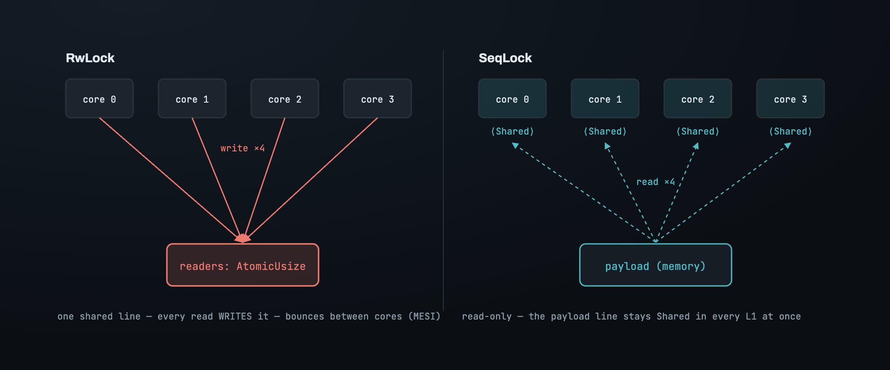

# Part 1 — The problem, and why the obvious locks don't fit

A blockchain node advances its canonical chain head about once every twelve seconds.
In the twelve seconds between, everything else in the node needs to know what the head
*is*: every `eth_blockNumber`, every `eth_call` tagged `latest`, every transaction the
mempool validates, every reply to a peer. Tens of thousands of reads a second, from
dozens of threads, against one write every twelve seconds. Or take an exchange: an
oracle thread updates `(mark_price, funding_index, timestamp)` once per tick, and the
risk engine reads it on *every single order* to compute margin. A slow read there is a
slow tail for the whole venue.

This is the shape a SeqLock is built for: **one value, written rarely, read constantly
from everywhere.** It sounds like it should be easy. It isn't, for two reasons that
have nothing to do with how often you read.

## The value doesn't fit in a register

A chain head is `(B256, u64)` — a 32-byte hash and an 8-byte number, 40 bytes. There
is no CPU instruction that writes 40 bytes indivisibly. The largest atomic store your
hardware offers is one machine word — 8 bytes on a 64-bit machine, 16 with a
double-width compare-and-swap if you're careful. Forty bytes is out of reach.

Which means there is *always* a window — however brief — where memory holds a value
that is half the old head and half the new one. A reader that lands in that window
doesn't get a stale value. It gets the hash of block 1000 paired with the number 999:
a value that **never existed**. Hand that to a user and it's wrong; feed it into a
state-root lookup and the node corrupts. Stale would be survivable — "a few
milliseconds behind" is fine. This is worse than stale. This is fabricated.

That limit is the hardware's, not the language's. Write it in C and it's exactly the
same.

## Atomic-per-field doesn't save you

Here's the reflex fix: make each field its own atomic. `mark_price` is a `u64`, wrap
it in an `AtomicU64`; `funding_index` too. Now every field reads atomically — no field
is ever torn. Problem solved?

No — because the problem was never a single field. The risk engine reads `mark_price`
from tick N and, a few nanoseconds later, reads `funding_index` from tick N+1, because
the writer updated both in between. Each read was atomic and correct in isolation. The
*pair* is a value that never existed, and the margin computed from it is wrong — enough
to liquidate an account that was actually healthy. That's real money, lost to a
consistency bug that per-field atomics are structurally incapable of catching.

So the real problem isn't "read 40 bytes safely." It's:

> **Publish a multi-field snapshot such that every reader always sees a snapshot that
> actually existed as a whole.**

## Three constraints, not one

If correctness were the only requirement this would be a solved and boring problem —
put a lock around it and go home. It's interesting because correctness comes wrapped in
three constraints that the lock will struggle with:

- **Readers must not slow the writer.** The engine thread advancing the chain head is
  the node's critical path; the oracle thread updating the mark price is too. If a
  reader can make the writer wait, we've let an unimportant thread block the most
  important one.
- **Readers must not slow each other.** There are thirty-two threads reading on
  thirty-two cores. They have no logical conflict — reading is shareable — so any cost
  that appears *only because other readers exist* is pure waste.
- **The read path must be bounded and allocation-free.** On the exchange it lives
  inside a per-order latency budget measured in microseconds. It cannot pause for a
  heap allocation, and it cannot retry without an upper bound.

Hold those three up against every candidate below; each one satisfies correctness and
breaks one of them.

## The asymmetry the mutex framing misses

Here is the observation the whole design turns on, and it's why this is *not* the
classic mutual-exclusion problem.

A mutex exists to solve "many parties all **modify**, so they must take turns." But here
only one party modifies. The only genuine conflict is between the writer and a reader,
and it is asymmetric in three ways:

1. **Reads outnumber writes by orders of magnitude.** Optimising the write path is
   optimising the wrong thing.
2. **The reader doesn't need the value held still.** It isn't modifying anything, so it
   has no need for "nobody touch this while I work." It needs a valid snapshot, then it
   goes off and computes on that snapshot; the value changing an instant later is fine.
   Because it's read-only, it needs *a* snapshot that once existed — not the *latest*
   one, and not a *frozen* one.
3. **The reader can redo its work.** If a read comes out garbled, reading again costs
   nothing — there's no side effect to roll back.

A mutex pays for a stronger guarantee than we need: it grants *exclusive possession*,
which the reader here never asked for. And the reader pays for that guarantee in the
one currency we can't afford — it has to write to shared memory to take the lock.

## So why not a `RwLock`? It already lets readers in together

The obvious objection: a read-write lock *is* built for many readers. Multiple readers
hold the read side at once. Isn't this over?

No — because "lets them in together" is a promise the *interface* makes that the
*implementation* can't keep for free. To let readers in together, the lock has to know
how many readers are currently inside, so it can tell when it's safe to admit a writer.
Knowing that means every reader increments a shared counter on the way in and
decrements it on the way out:

Logically those readers don't conflict. Physically they do. That counter lives on one
cache line, and a cache line written by one core must be invalidated in every other
core that holds it — the MESI protocol. So thirty-two readers on thirty-two cores,
with no logical conflict whatsoever, spend their time bouncing one line between them:

Reading is supposed to be shareable, and here it is *anything but* — the readers
serialise on metadata the lock needs only to exist. Worse, the reader still blocks the
writer: while any reader holds the read side, the writer waits, which violates the
first constraint too. `RwLock` is logically right and physically exclusive.

## And why not swap a pointer? (`ArcSwap`, RCU)

There's a cleverer family that sidesteps the tearing entirely. Don't overwrite in
place — build the new value somewhere else, then flip a single pointer to it. A pointer
is 8 bytes, so the flip *is* atomic; a reader sees either the whole old value or the
whole new one, never a mix. This is what `ArcSwap` and RCU do, and for large or
pointer-rich values it's the right tool.

But it moves the hard part rather than removing it. Once the writer flips the pointer,
some readers may still be reading the old value. When is it safe to free? The writer
has to know whether any reader still holds the old pointer — which means the reader
must, again, *announce its presence* (a reference count, an epoch, a hazard pointer).
We're back to readers writing shared state, plus an allocation on every write and a
reclamation problem to manage. Correct, and often worth it — but it breaks the same
constraints, for the same underlying reason.

## What every failure has in common

Line the candidates up:

| | reader must… | breaks |
|---|---|---|
| `Mutex` | take an exclusive lock | readers serialise with each other |
| `RwLock` | write a shared reader counter | readers bounce one cache line; still block the writer |
| `ArcSwap` / RCU | announce itself for reclamation | shared write + allocation per write |
| per-field atomics | (nothing) | no cross-field consistency — the fabricated pair |

Every row that's correct forces the reader to write to shared memory or to make the
writer wait. The one row that does neither isn't correct. The constraints are pointing
at a single conclusion:

> **The reader must be invisible** — it must not write shared memory, and the writer
> must run as if no reader exists at all.

That sounds impossible: if the writer never coordinates with readers, what stops a
reader from reading a half-written value? Nothing does. So the move — the whole idea of
a SeqLock — is to stop *trying* to prevent it, and instead let the reader read the mess
and then *notice*. That's Part 2.

---

*Next: [Part 2 — The bet: let it tear, and catch it](02_the_bet.md) · [Index](00_index.md)*

*Deutsch: [`../de/01_the_problem.md`](../de/01_the_problem.md)*
