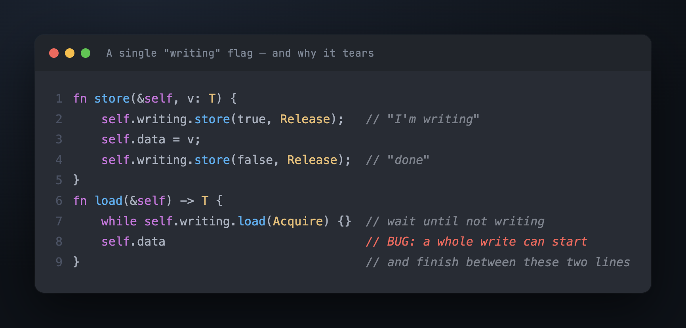
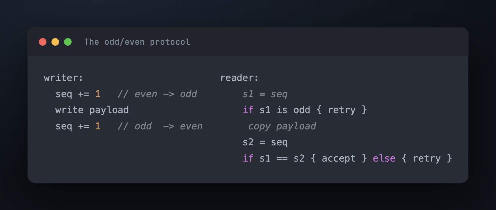

# Part 2 — The bet: let it tear, and catch it

Part 1 backed us into a corner. Every lock forces the reader to write shared memory or
forces the writer to wait, and the only candidate that does neither — per-field
atomics — is wrong. The constraints demanded an invisible reader: one that writes
nothing shared, against a writer that behaves as if no reader exists.

If the writer won't coordinate, nothing prevents a reader from seeing a half-written
value. So stop trying to prevent it. **Let the writer overwrite in place, let the read
tear, and give the reader a way to notice afterward and read again.** The reader is
read-only and can redo its work for free (Part 1's third asymmetry), so a wasted read
costs nothing but a little time. That's the bet.

It reduces the entire problem to one question:

> How does a reader know, after the fact, that it read *during* a write?

Everything else follows from answering that.

## First attempt: a "writing" flag

The obvious detector is a boolean the writer raises while it works. The reader waits
for it to be clear, then reads:



Trace it and it falls apart. The reader checks `writing`, sees `false`, and starts
reading. *Then* a writer runs — flag up, overwrite, flag down — entirely inside the
reader's read. The reader never re-checks; it already passed the gate. It walks away
with a value that is half-old, half-new, and the flag was `false` both times it
mattered.

The deeper problem isn't the missing re-check. It's that **a boolean has no memory.**
"Nobody is writing right now" and "somebody wrote while you weren't looking" are the
same value — `false`. A flag can tell you the current state; it cannot tell you whether
the state *changed* while you were busy. And "did it change while I was busy" is
exactly the question.

## What the detector actually needs

So the reader needs to sample the detector *twice* — once before it copies, once
after — and conclude "no write overlapped me" only if the two samples agree. For that
comparison to mean anything, the detector must have a property the boolean lacks:

> Every time the writer touches it, it must become a value it has **never been
> before**.

If it just toggled, two samples could match by coincidence — the writer flipped it and
flipped it back while the reader copied, and the reader sees the same value at both
ends and wrongly concludes nothing happened. A value that never repeats forecloses that
coincidence. The natural such value is a counter that only ever counts up.

There's a second thing the twice-sampling misses. Reading the counter before and after
catches a write that *finished* during the copy — the counter advanced. It does not
catch a write already *in progress* when the reader arrived: the counter could sit
unchanged at the same value throughout, yet the payload was mid-flight the whole time.
So the counter must also encode, in its value, "a write is happening right now," and
the reader must refuse to even start copying when it sees that.

One integer can carry both signals at once. Let the counter be **even when the value is
stable and odd while a write is in progress.** A single increment does both jobs: it
flips the parity (so odd announces "writing now") and it produces a never-seen-before
number (so two equal even samples prove "nothing happened between them"). The writer
increments once on the way in — even to odd — and once on the way out — odd to even.

## The protocol



Read it as a contract between the two sides. The writer promises: the payload is only
ever touched while the counter is odd. The reader checks two things and trusts its copy
only if both hold — the counter was **even** when it started (no write in progress),
and it was the **same** even value when it finished (no write began and ended in
between). Anything else, it loops and tries again.

Walk the two dangerous interleavings and see them both caught:

```
reader starts while a write is in progress:
  s1 = seq  →  odd   →  reader doesn't even copy; it retries.  ✓

a write starts and ends during the copy:
  s1 = seq  →  8 (even, ok)
  copy payload …          ← writer runs here: 8 → 9 → 10
  s2 = seq  →  10         → s1 ≠ s2 → retry.                    ✓
```

Both holes closed with one counter. Notice what the reader never does: it never writes
shared memory. Two loads, a copy, two more loads, all reads. The writer never waits for
a reader — it increments and goes. There is no old value to reclaim, because the writer
never made a new one; it overwrote in place. Every constraint from Part 1 is satisfied,
and we got there by embracing the tearing instead of fighting it.

You could stop here and believe you're done. The logic is complete and every case
checks out on paper. So here's the uncomfortable part: this exact protocol, written in
the obvious way, **still tears** — not because the logic is wrong, but because the
machine underneath does not run your instructions in the order you wrote them. That's
Part 3, and it's where most real SeqLock bugs actually live.

---

*Next: [Part 3 — Getting the memory ordering right](03_memory_ordering.md) · [Index](00_index.md)*

*Deutsch: [`../de/02_the_bet.md`](../de/02_the_bet.md)*
