# Part 3 — Getting the memory ordering right

At the end of Part 2 we had a protocol, and it was correct. The writer bumps a
sequence counter to odd, writes the payload, bumps it back to even. The reader reads
the counter, copies the payload, reads the counter again, and trusts the copy only if
both reads matched and were even. On paper, airtight.

Here it is, all orderings `Relaxed` — atomic, but making no promise about *order*:

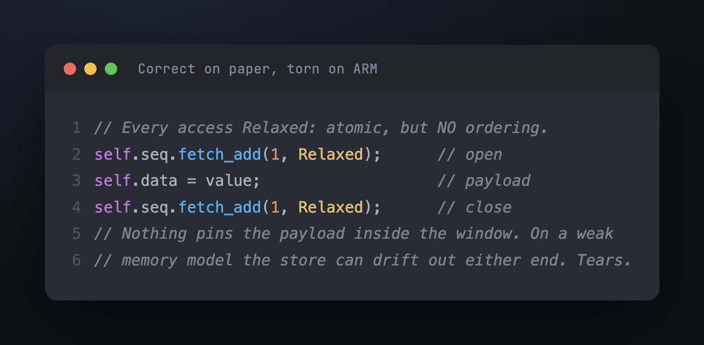

Run it on an Apple M2 under real contention and it tears — a reader gets
`[54458, 54458, 54459, 54459]`, half one version and half the next. Not every time.
Four runs out of five come back green. That ratio — mostly-green, occasionally-wrong —
is the fingerprint of a memory-ordering bug, and it's why you cannot trust a passing
test here. (On x86 it would pass every time, and ship, and then fail on your ARM
server. This is the bug that "works on my machine" was invented for.)

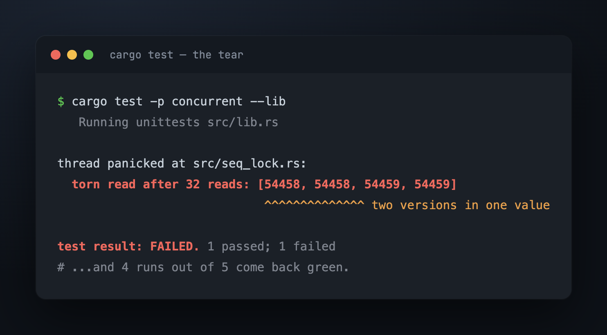

## The window is real; the payload isn't inside it

The protocol builds a window. The writer's two bumps are its edges; the payload is
supposed to live between them. The reader's two counter reads build a matching window;
the copy is supposed to live between *those*.

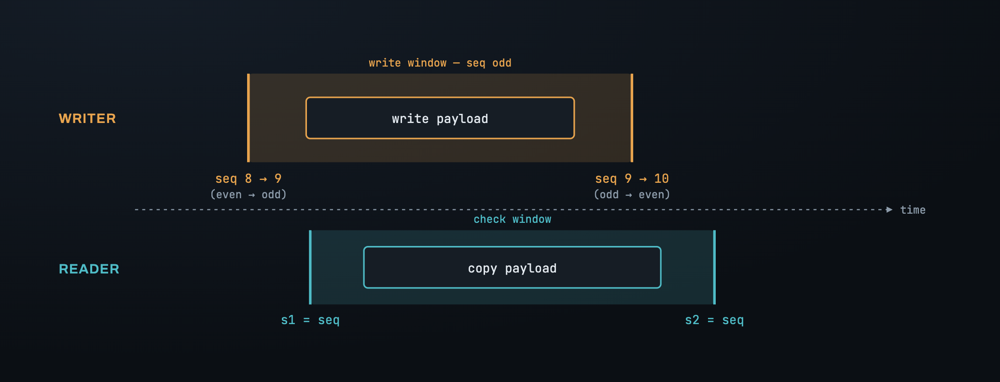

But nothing in the code so far *forces* the payload to stay inside. `Relaxed` means
exactly what it says: the operation is atomic, and its order relative to everything
around it is unconstrained. The compiler may reorder; the CPU — on a weak memory model
like aarch64 — may reorder at execution time, as long as *this one thread's* own view
stays consistent. Another thread sees the shuffle.

So the payload can escape the window through any of four edges:

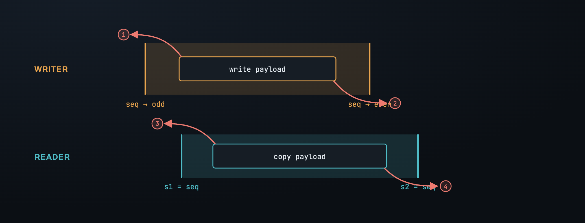

① the writer's payload store floats up *above* the bump-to-odd, so a reader sees an
even counter while the data is already half-changed. ② it sinks *below* the
bump-to-even, so the counter says "stable" before the write finishes. ③ the reader's
copy floats up above `s1`, or ④ sinks below `s2` — validated, then re-read. Each edge
is a separate leak, and each needs a separate decision.

## The idea people get backwards: one-way gates

To pin the payload we reach for `Release` and `Acquire`. The universal mistake is to
picture them as walls that block both directions. They don't. **Each is a one-way
gate, and it guards only one side of the operation it's attached to.**

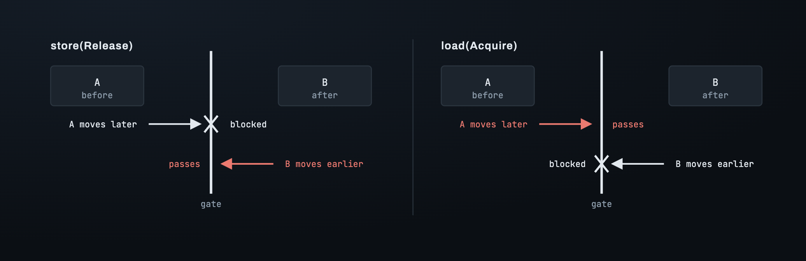

`Release` on a store is a *floor under what comes before it*: nothing above can sink
past. It says nothing about what comes after. `Acquire` on a load is a *roof over what
comes after it*: nothing below can rise past. It says nothing about what comes before.
The red arrow in each panel is the direction that is *not* guarded — and that
unguarded direction is exactly the one people forget.

Watch it turn the very first fix wrong. The instinct is: the bump-to-odd opens the
window, so make it a `Release`.

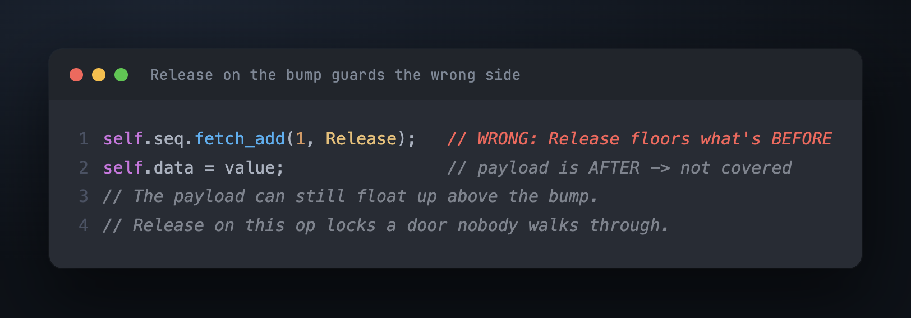

The thing we need to hold down is the payload, and the payload comes *after* the bump.
`Release` guards the *before* side. We just locked a door nobody walks through, and
escape route ① is still wide open. The word is right; the side is wrong.

## Four edges, four decisions

Ask one question at each edge: *is the thing I need to hold on the side this operation's
gate already covers, or the opposite side?* Same-side, an ordering on the atomic itself
suffices. Opposite-side, you need a standalone `fence` dropped exactly at the boundary.

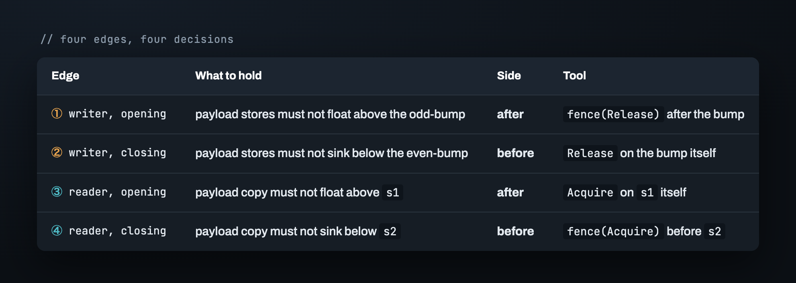

Notice the symmetry: the two edges that *open* a window need to hold what comes after;
the two that *close* it need to hold what comes before. And exactly two of the four —
① and ④ — land on the side the operation's own gate can't reach, so they can't use an
ordering-on-the-op at all. They need a fence.

## Why a fence, and not just a stronger ordering

Take edge ④, the clearest case. We need the payload copy — which sits *before* `s2` —
not to sink below it. The tempting fix is to make `s2` an `Acquire` load. But an
`Acquire` roofs what comes *after* `s2`; the copy is *before* it, uncovered. The copy
sinks right through.

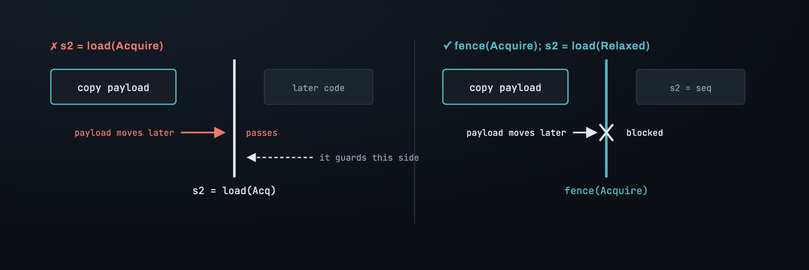

A `fence(Acquire)` placed *between* the copy and `s2` is a free-standing barrier the
copy cannot cross. Now it's pinned above the fence, hence above `s2`. Same word,
opposite effect — because a fence is a wall you position, while an ordering-on-an-op is
a one-sided gate glued to that op. (There is one more thing an ordering can't do that a
load's ordering *especially* can't: `load(Release)` isn't even a legal operation — it
panics. `Release` is the verb of publishing, which belongs to writes; a load has
nothing to publish. So `s2` stays `Relaxed`, and the fence does the work.)

Here is the whole thing, correct, every gate in place:

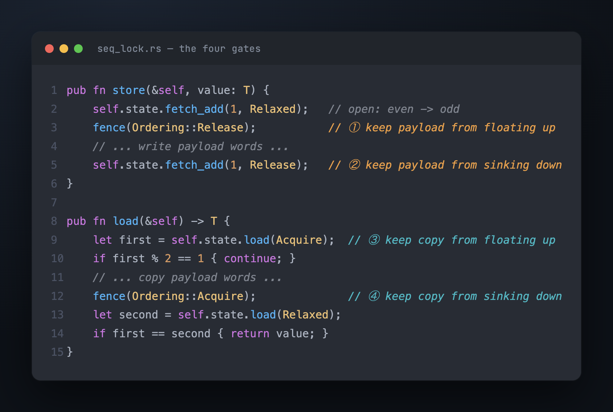

The two `Relaxed`s left in the code aren't laziness — they're the edges where an
ordering would guard a side with nothing on it, so the fence beside them does the job
instead.

That whole split — when the ordering on the atomic is enough and when you must reach
for a fence — comes down to one distinction, worth keeping:

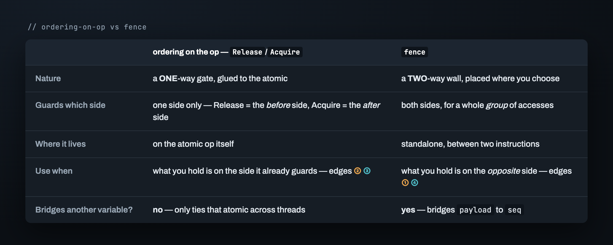

## What the fences actually buy: a handshake

Everything above is the operational picture — enough to place the code correctly. But
the *reason* it's correct, and the reason a fence is the tool, is deeper than "stops
reordering." Two fences on two threads **shake hands** to build a happens-before
relationship, and that relationship is the real guarantee.

The claim to prove is single:

> If the reader's copy picks up **even one byte** of write N, then the reader's `s2`
> read **must** observe write N's odd-bump.

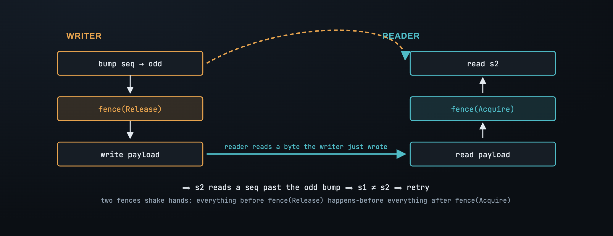

Alone, each fence only orders its own thread. But when the reader reads a byte the
writer stored *after* its `fence(Release)`, and the reader runs `fence(Acquire)` after
the read, the two fences lock together: everything before the writer's fence
happens-before everything after the reader's fence. The odd-bump is on the first side;
`s2` is on the second. So a torn read is *guaranteed* to be caught — `s1 != s2`, retry.

This is also why an ordering-on-the-op wouldn't be enough even where it type-checks: an
ordering on an atomic ties *that atomic* across threads, but here the data channel is
the **payload** and the thing we synchronise on is the **seq** — two different
variables. Only a fence bridges from one to the other.

The protocol from Part 3 is now correct not just on paper but on the hardware. What's
left is a subtler crime we've been committing the whole time: the reader has been
reading bytes the writer is actively changing, and in Rust's memory model that isn't
merely "reading garbage" — it's undefined behaviour. That's Part 4.

---

*Next: [Part 4 — Reading without UB, and trusting it](04_trusting_it.md) · [Index](00_index.md)*

*Deutsch: [`../de/03_memory_ordering.md`](../de/03_memory_ordering.md)*
